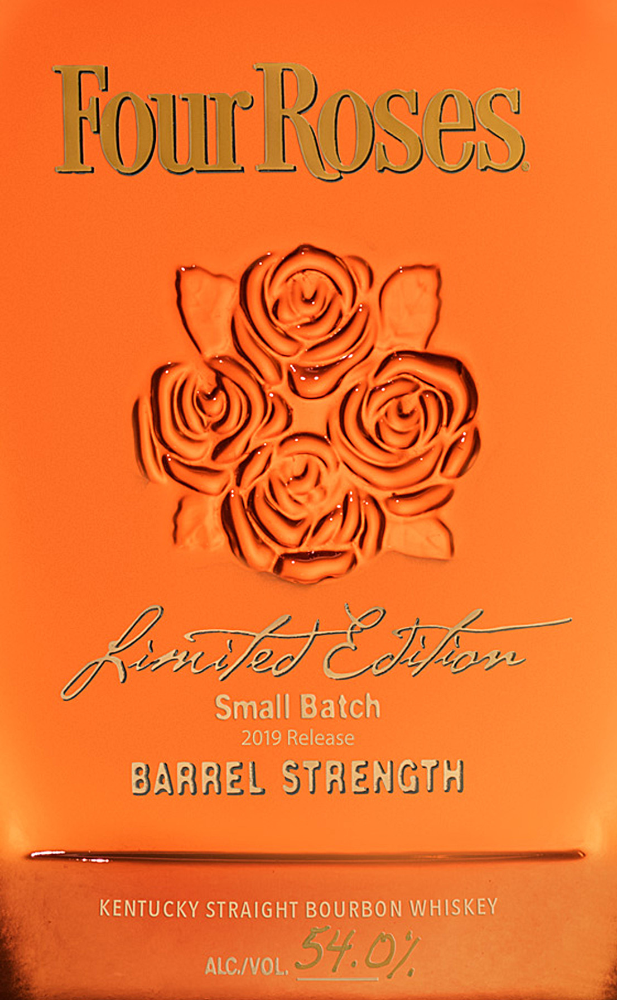
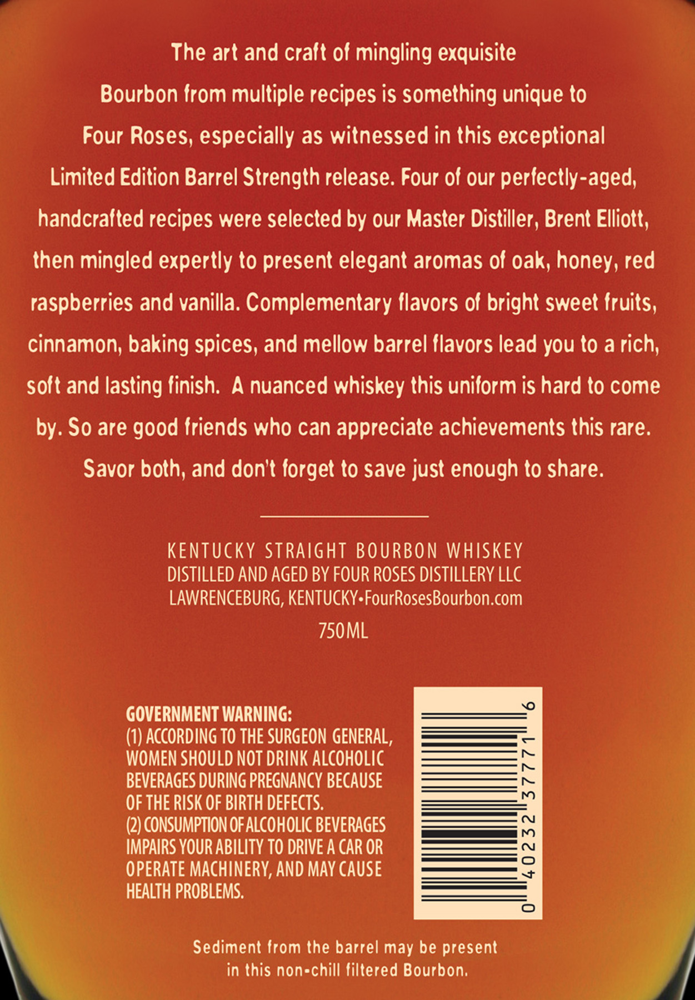

# TTB COLA Label Images - TTBID 19142001000678

**Brand Name:** FOUR ROSES

**Fanciful Name:** LIMITED EDITION SMALL BATCH

**Issue Date:** 06/06/2019

**Origin Code:** 22

**Product Class/Type:** 101

**Source:** [TTB Public COLA Registry](https://ttbonline.gov/colasonline/viewColaDetails.do?action=publicFormDisplay&ttbid=19142001000678)

## Label Images

### Label 1

### Label 2

### Label 3

## Extracted Label Text

*Text extracted via OCR - may contain errors*

*1 image(s) excluded: text did not meet readability threshold*

### Label 1

WouRoses
/ )
paupdZ Jf,x
Small Batch
2019 Release
BARREL Staength
KENTUCKY StRAIGHT BOURBON WhHISKEV
ALC IVOL,
54,07

### Label 2

The art and cralt of mingling exquisite
Bourbon Irom multiple recipes is something unique to
Four Roses; especially as witnessed in this exceptional
Limited Edition Barrel Strength release. Four of our perfectly-aged;
handcralted recipes were selected by our Master Distiller, Brent Elliott;
then mingled expertly to present elegant aromas of oak, honey, red
raspberries and vanilla: Complementary Ilavors of bright sweet {ruits,
cinnamon; baking spices, and mellow barrel flavors lead you to a rich;
soft and lasting linish
A nuanced whiskey this unilorm is hard t0 come
by: So are
friends who can appreciate achievements this rare:
Savor both; and don't forget to save just enough to share.
KENTUCKY StRaight BOURBON WHISKEY
DISTILLED AND AGED BY FOUR ROSES DISTILLERY LLC
LAWRENCEBURG, KENTUCKY FourRosesBourbon.com
750ML
J
GOVERNMENT WARNING:
(1) AccORding TO THE SURGEON GENERAL,
WOMEN SHOULD NOT DRINK ALCOHOLIC
BEVERAGES DURING PREGNANCY BECAUSE
[
OF THE RISK OF BIRTH DEFECTS.
(2) CONSUMPTION OF ALCOHOLIC BEVERAGES
IMPAIRS YOUR ABILITY TO DRIVE A CAR OR
1
OPERATE MACHINERY, AND MAY cause
HEALTH PROBLEMS.
0
Sediment Irom the barrel may be present
in this non-chill filtered Bourbon;
good
