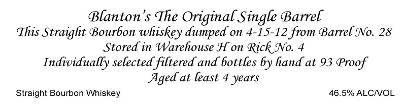

# TTB COLA Label Images - TTBID 19222001000002

**Brand Name:** BLANTON'S

**Fanciful Name:** THE ORIGINAL SINGLE BARREL

**Issue Date:** 09/30/2019

**Origin Code:** 92

**Product Class/Type:** 192

**Source:** [TTB Public COLA Registry](https://ttbonline.gov/colasonline/viewColaDetails.do?action=publicFormDisplay&ttbid=19222001000002)

## Label Images

### Back Label

### Label 2

## Extracted Label Text

*Text extracted via OCR - may contain errors*

**Detected Proof:** 93
**Detected Age:** 4 Years

### Back Label

Blanton'$ The Original Single Barrel
This Straight Bourbon whiskey dumped on 4-15-12 from Barrel No. 28
Stored in Warehouse H on Rick No.
Individually selected filtered and bottles by hand at 93 Proof
Aged at least 4 years
Straight Bourbon Whiskey
46.5% ALCNOL

### Label 2

CONTENTS 750ML
ALC. 46.5% BY VOL
PRODUCT OF USA
STRAIGHT BOURBON WHISKEY
EXPORTED TO UK AND REIMPORTED INTO THE US BY
FINER THINGS IMPORTS; MARINA DEL REY, CA
GOVERNMENT
WARNING: (1) According
to
the Surgeon
General
women
should
not
drink
alcoholic
beverages
during
pregnancy
because
of
the
risk
of
birth
defects_
(2)
Consumption
of
alcoholic
beverages impairs your ability to drive a car or operate machinery, and
may cause health problems
