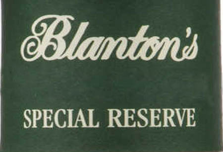
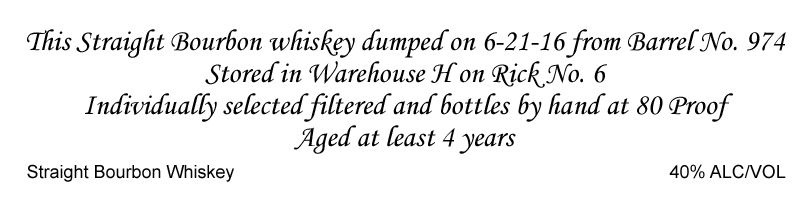

# TTB COLA Label Images - TTBID 19222001000003

**Brand Name:** BLANTON'S

**Fanciful Name:** SPECIAL RESERVE

**Issue Date:** 09/30/2019

**Origin Code:** 92

**Product Class/Type:** 192

**Source:** [TTB Public COLA Registry](https://ttbonline.gov/colasonline/viewColaDetails.do?action=publicFormDisplay&ttbid=19222001000003)

## Label Images

### Back Label

### Front Label

### Label 3

## Extracted Label Text

*Text extracted via OCR - may contain errors*

*1 image(s) excluded: text did not meet readability threshold*

### Front Label

This Straight Bourbon whiskey dumped on 6-21-16 from Barrel No. 974

Stored in Warehouse H on Rick No. 6

Individually selected filtered and bottles by hand at 80 Proof

Aged at least 4 years

40% ALC/VOL

Straight Bourbon Whiskey

### Label 3

CONTENTS 750ML

ALC.40% BY VOL.

PRODUCT OF USA

STRAIGHT BOURBON WHISKEY

EXPORTED TO UK AND REIMPORTED INTO THE U.S. BY

FINER THINGS IMPORTS, MARINA DEL REY, CA

GOVERNMENT WARNING: (1) According to the Surgeon General,

women should not drink alcoholic beverages during pregnancy

because of the risk of birth defects. (2) Consumption of alcoholic

beverages impairs your ability to drive a car or operate machinery, and

may cause health problems.
