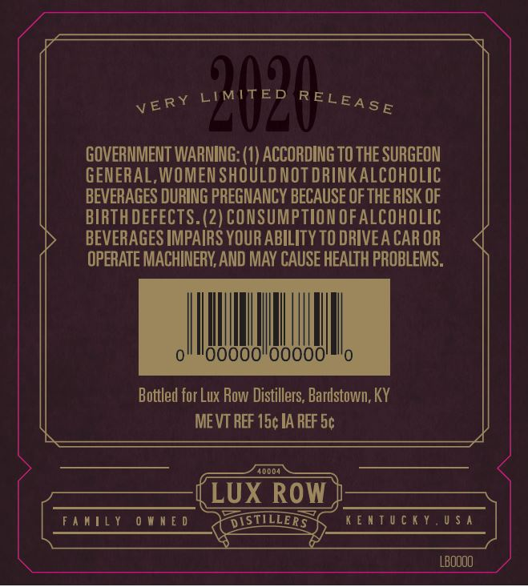
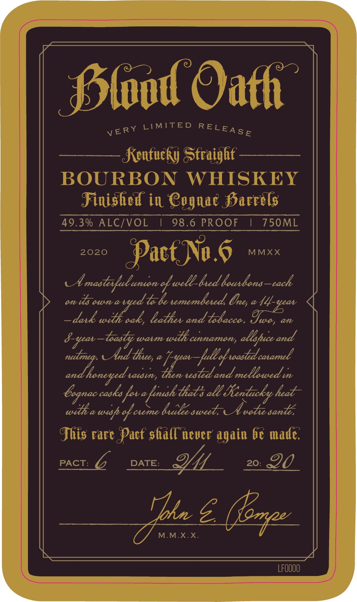
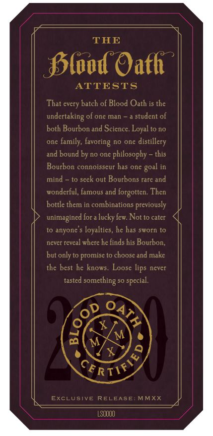
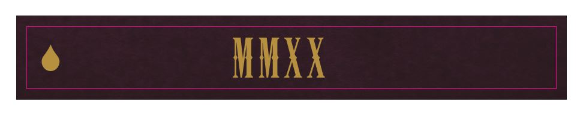
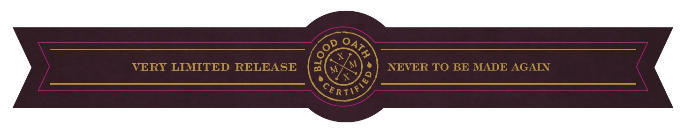

# TTB COLA Label Images - TTBID 19225001000103

**Brand Name:** BLOOD OATH

**Fanciful Name:** PACT NO. 6

**Issue Date:** 09/24/2019

**Origin Code:** 29

**Product Class/Type:** 640

**Source:** [TTB Public COLA Registry](https://ttbonline.gov/colasonline/viewColaDetails.do?action=publicFormDisplay&ttbid=19225001000103)

## Label Images

### Back Label

### Label 1

### Label 3

### Label 4

### Label 5

## Extracted Label Text

*Text extracted via OCR - may contain errors*

*1 image(s) excluded: text did not meet readability threshold*

**Detected Proof:** 98.6

### Back Label

LIMITED
A
GOVERNMENT WARNING: (1) ACCORDING TO THE SURGEON
GENERAL,WOMEN SHOULD NOT DRINKALCOHOLIC
BEVERAGES DURING PREGNANCY BECAUSE OF THE RISK OF
BIRTHDEFECTS. (2) CONSUMPTION OFALCOHOLIC
BEVERAGES IMPAIRS YOUR ABILITY TO DRIVEA CAR OR
OPERATE MACHINERY, AND MAY CAUSE HEALTH PROBLEMS.
Bottled for Lux Row Distillers; Bardstown, KY
ME VT REF 15c IA REF 5c
40004
LUX ROw
FamILY
0 W n E 0
DISTILLERS
K[nTU [iy.U $ ^
LBOOOO
RELEASE
VERY

### Label 1

fSlod Oafh
LIMTTED
Kenfucky Sfraighf -
BOURBON
WHISKEY
Finished in Cegnac Sarrels
49.3% ALC/VOL
98.6 PROOF
750ML
2020
PacfNa,6
MMXX
Ul mastotlunton -
well_led lounlono
each
anv
is oun aved
Veadd,
tememleted
daxk with oak, lathev and tolacca ,
an
-toosby
watm
wih cnnamon; allbpuce and
And
fullok ocstdc
talstn,
"Ionaes
tested and mellowed t
bognac casks for e fusk-that % alL Sentacky headt-
witkewuf ooeme kelsweed UAvobsent
Ihis rare Pacf shall never again 6e made:
PACT:
DATE:
20:
90
Tbin 5
(ezpe
M.MXX
Lfoooo
RELEASE
VERY
Unes
44-av
Iwo ,
8-ypav -
thxe,
catamel
riatowoodt

### Label 3

THE
SSlod Oafh
ATTESTS
That every batch of Blood Oath is the
undertaking of one man
student of
both Bourbon and Scicnce. Loyal to no
one
family, (avoring
no one
distillery
and bound by no onc philosophy
this
Bourbon connoisseur has one
mind
to seck out Bourbons rare and
wondcrful, famous and
forgotten: Then
bottle them in combinations previously
unimagined for a lucky few Not to cater
to anyone
loyalties, he has sworn to
nevcr revcal whcrc hc finds his Bourbon;
but only to promise to choose and make
thc best he knows.
lips never
tasted
X
M
M
X
EXCLUSIVE RELEASE
MMXX
LSQOO
goal
Loose
something
special
3
CRTIR>

### Label 5

VERY LIMITED RELEASE
NEVER TO BE MADE AGAIN
CeRTIA)
