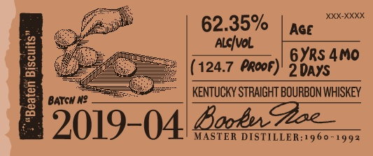

# TTB COLA Label Images - TTBID 19238001000809

**Brand Name:** BOOKER'S

**Issue Date:** 09/19/2019

**Origin Code:** 22

**Product Class/Type:** 101

**Source:** [TTB Public COLA Registry](https://ttbonline.gov/colasonline/viewColaDetails.do?action=publicFormDisplay&ttbid=19238001000809)

## Label Images

### Label 1

### Label 2

### Label 3

### Label 4

## Extracted Label Text

*Text extracted via OCR - may contain errors*

### Label 1

booker

Bho Wibuy tm shea frchege Ae

(es

mila

Satta sper tds ur fll

Wy rm o lin Loan bh his

eee, || == |

PEN LES epens

s<¢e

barrel tured.

cened jlo .

### Label 2

Ge

iit

62.35%

(124.7 PRoor)

2 aaa

Bobs STRAIGHT BOURBON WHISKEY

5019- 04 Looker: DISTILLER:1960-1993

### Label 3

l

80686'01140'

### Label 4

»—~
