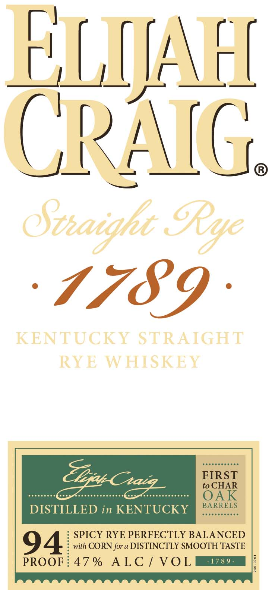
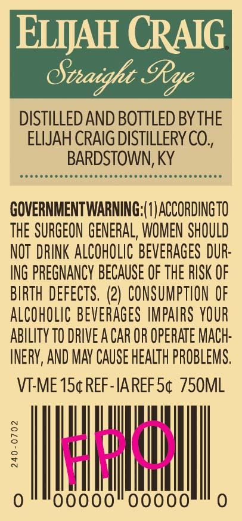

# TTB COLA Label Images - TTBID 19248001000811

**Brand Name:** ELIJAH CRAIG

**Issue Date:** 10/16/2019

**Origin Code:** 22

**Product Class/Type:** 102

**Source:** [TTB Public COLA Registry](https://ttbonline.gov/colasonline/viewColaDetails.do?action=publicFormDisplay&ttbid=19248001000811)

## Label Images

### Label 1

### Label 2

### Label 3

## Extracted Label Text

*Text extracted via OCR - may contain errors*

*1 image(s) excluded: text did not meet readability threshold*

**Detected Proof:** 94

### Label 1

ELIjAFI
CPAC
8teaighc _
1789
KENTUCKY STRAIGHT
RTE WHISKET
FIRST
to CHAR
OAK
BARRELS
DISTILLED in KENTUCKY
SPICY RYE PERFECTLY BALANCED
94
with CORN for a DISTINCTLY SMOOTH TASTE
PROOF
47 %
ALC / VOL
'178 9 .
GRye
Tleat Chaig

### Label 2

ELIJAH CRAIG

Straight Rye

DISTILLED AND BOTTLED BY THE

ELIJAH CRAIG DISTILLERY CO.

BARDSTOWN, KY

Deeescsececsccccecseeresescsecscscccecss

GOVERNMENTWARNING:|1) ACCORDINGTO

THE SURGEON GENERAL, WOMEN SHOULD

NOT DRINK ALCOHOLIC BEVERAGES DUR

ING PREGNANCY BECAUSE OF THE RISK OF

BIRTH DEFECTS. (2) CONSUMPTION OF

ALCOHOLIC BEVERAGES IMPAIRS YOUR

ABILITY TO DRIVE A CAR OR OPERATE MACH

INERY, AND MAY CAUSE HEALTH PROBLEMS

VT-ME 15¢REF-IAREF 5¢ 750ML

MI i

i

Vid

i

nl

Ie qu

0
