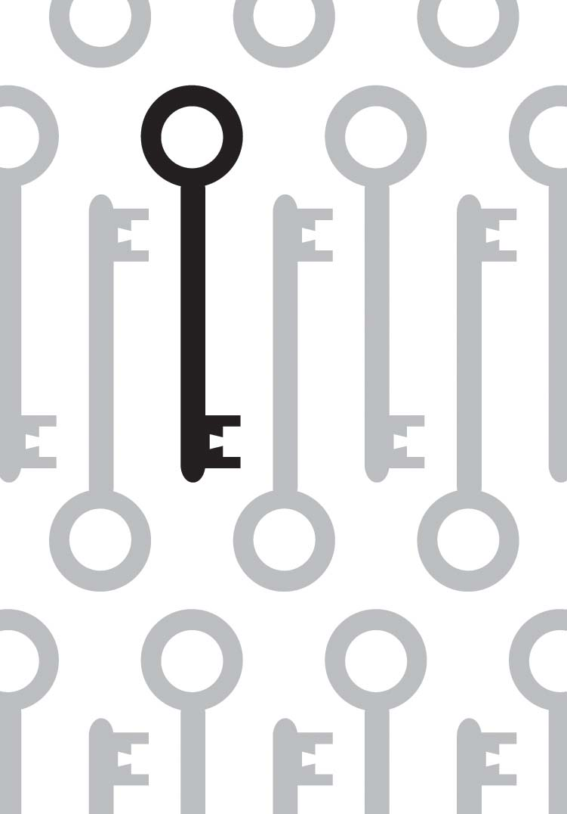
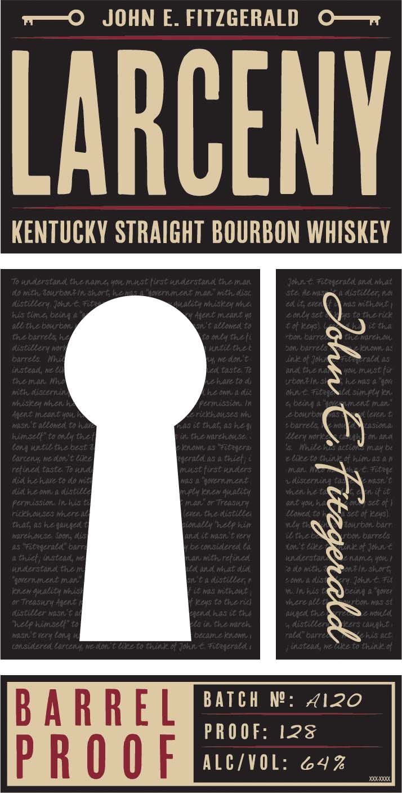

# TTB COLA Label Images - TTBID 19249001000186

**Brand Name:** LARCENY

**Fanciful Name:** BARREL PROOF

**Issue Date:** 10/03/2019

**Origin Code:** 22

**Product Class/Type:** 101

**Source:** [TTB Public COLA Registry](https://ttbonline.gov/colasonline/viewColaDetails.do?action=publicFormDisplay&ttbid=19249001000186)

## Label Images

### Back Label

### Label 1

## Extracted Label Text

*Text extracted via OCR - may contain errors*

### Back Label

PP eS

in

### Label 1

w—oO JOHN E. FITZGERALD O—r

LARCENY

KENTUCKY STRAIGHT BOURBON WHISKEY

Q

;

9)

~

B A R R F [ BATCH NP: 4120

PROOF: 12

p A () 0 | ALC/VOL: 24% =
