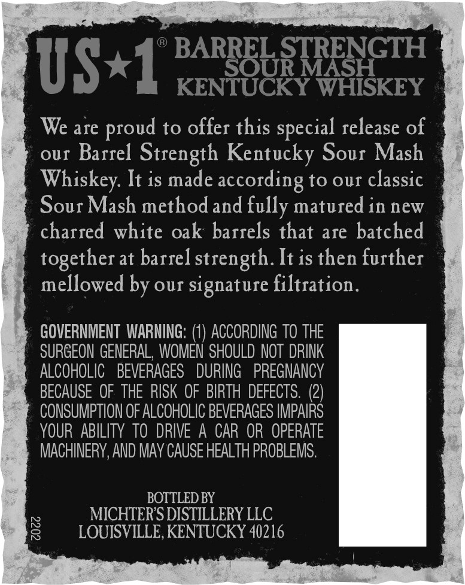
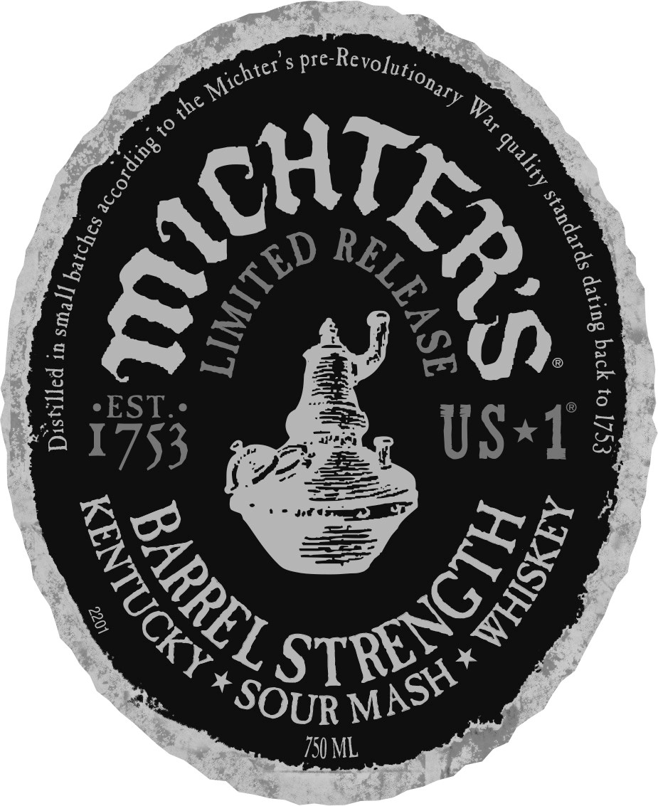
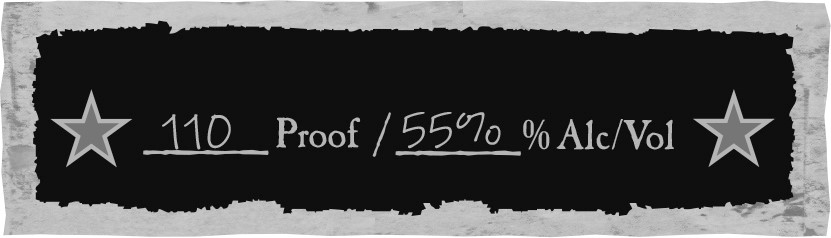
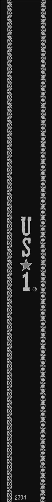
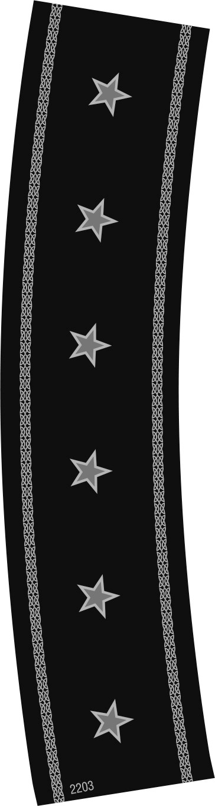
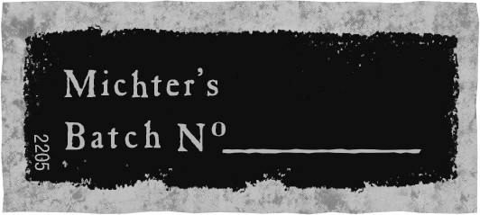

# TTB COLA Label Images - TTBID 19274001000463

**Brand Name:** MICHTER'S

**Fanciful Name:** BARREL STRENGTH - SOUR MASH

**Issue Date:** 10/28/2019

**Origin Code:** 22

**Product Class/Type:** 140

**Source:** [TTB Public COLA Registry](https://ttbonline.gov/colasonline/viewColaDetails.do?action=publicFormDisplay&ttbid=19274001000463)

## Label Images

### Back Label

### Label 1

### Label 2

### Label 4

### Label 5

### Label 6

## Extracted Label Text

*Text extracted via OCR - may contain errors*

*5 image(s) excluded: text did not meet readability threshold*

### Back Label

BARREL STRENGTH
US*1
SOUR MASH
KENTUCKY WHISKEY
We are
to offer this
release of
our Barrel Strength Kentucky Sour Mash
Whiskey It is made according to our classic
Sour Mash methodand fully matured in new
charred white oak barrels that are batched
together at barrel strength It is then further
mellowed by our signature filtration.
GOVERNMENT WARNING:
ACCORDING To THE
SURGEON GENERAL, WOMEN SHOULD NOT  DRINK
ALCOHOLIC
BEVERAGES
DURING
PREGNANCY
BECAUSE OF THE RISK OF BIRTH  DEFECTS. (2)
CONSUMPTION OF ALCOHOLIC BEVERAGES IMPAIRS
YOUR  ABILITY  To  DRIVE  A CAR OR  OPERATE
MACHINERY,AND MAY CAUSE HEALTH PROBLEMS.
BOTTLED BY
MICHTERS DISTILLERY LLC
8
LOUISVILLE, KENTUCKY 40216
proud
special
