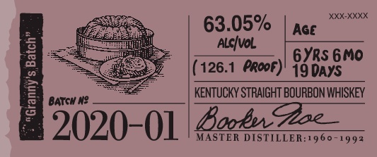

# TTB COLA Label Images - TTBID 19312001000601

**Brand Name:** BOOKER'S

**Issue Date:** 12/05/2019

**Origin Code:** 22

**Product Class/Type:** 101

**Source:** [TTB Public COLA Registry](https://ttbonline.gov/colasonline/viewColaDetails.do?action=publicFormDisplay&ttbid=19312001000601)

## Label Images

### Label 1

### Label 2

### Label 3

### Label 4

## Extracted Label Text

*Text extracted via OCR - may contain errors*

*1 image(s) excluded: text did not meet readability threshold*

### Label 1

booker

Bho Wibuy tm shea frchege Ae

(es

mila

Satta sper tds ur fll

Wy rm o lin Loan bh his

eee, || == |

PEN LES epens

s<¢e

barrel tured.

cened jlo .

### Label 2

H fe, 63.05% XXXKXKHK
= 3 aan
= pareve = _| KENTUCKY STRAIGHT BOURBON WHISKEY
2020-0] | AeA _

MASTER DISTILLER:1960~1992

### Label 3

BOOKER'Se KENTUCKY STRAIGHT BOURBON WHISKEY
DISTILLED AND BOTTLED BY JAMES B. BEAM DISTILLING CO_
CLERMONT, KENTUCKY
GOVERNMENT WARNING: C
ACCORDIHG TO
THE   SURGEOH  GENERAL, WOMEN   ShOuLI
NOT DRNKALCOHOLIC BEVERAGES DUFIG
PREGHANCY
BECAUSE
OF
THE
RISK
OF BIRTH defects. (2| COMSUMPTLON OF
AlCOhOlC BEVERAGES   IMPAIRS  YOUR
abiLty TO DRIVE A CAR OR OPERATE MAChI:
ERK, AND  MAY  CAUSE  health  PROBLEMS ,
80686"01140'
ME VT REF [Sc + IA REF Sc
124-2455-A
