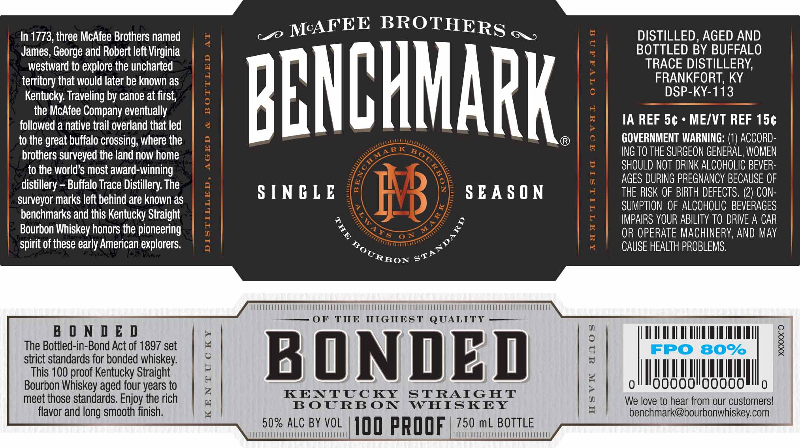

# TTB COLA Label Images - TTBID 19318001000780

**Brand Name:** BENCHMARK

**Issue Date:** 12/18/2019

**Origin Code:** 22

**Product Class/Type:** 101

**Source:** [TTB Public COLA Registry](https://ttbonline.gov/colasonline/viewColaDetails.do?action=publicFormDisplay&ttbid=19318001000780)

## Label Images

### Label 1

## Extracted Label Text

*Text extracted via OCR - may contain errors*

**Detected Proof:** 100

### Label 1

In 1773, three McAfee Brothers named
BROTHERS
6
DISTILLED, AGED AND
James; George and Robert left Virginia
BOTTLED BY BUFFALO
westward to explore the uncharted
1
TRACE DISTILLERY;
territory that would later be known as
1
FRANKFORT, KY
Kentucky: Traveling by canoe at first;
BBHCHHARK
DSP-KY-113
the McAfee Company eventually
followed a native trail overland that led
0
:
IA REF 5c
ME/VT REF 15c
to the great buffalo crossing; where the
8
GOVERNMENT WARNING: (1) ACCORD-
brothers surveyed the land now home
1
RK
ING TO THE SURGEON GENERAL, WOMEN
to the world $ most award-winning
6
SHOULD NOT DRINK ALCOHOLIC BEVER-
distillery
Buffalo Trace Distillery The
0
AGES DURING PREGNANCY BECAUSE OF
surveyor marks left behind are known as
S [ NC L E
8B
S EA S 0 N
THE RISK OF BIRTH DEFECTS, (2) CON-
SUMPTION  OF ALCOHOLIC   BEVERAGES
benchmarks and this Kentucky Straight
1

IMPAIRS YOUR ABILITY TO DRIVE A CAR
Bourbon Whiskey honors the pioneering
OR OPERATE MACHINERV, AND May
spirit of these early American explorers:
CAUSE HEALTH PROBLEMS,
OF
THE
HIGHEST
QUALITY
B
0 N 0 & 0
The Bottled-in-Bond Act of 1897 set
;
1
FPO
809
8
strict standards for bonded whiskey:
BONDED
This 100 proof Kentucky Straight
6
Bourbon Whiskey aged four years to

KENTUCKY
STRAIG HT
1
meet those standards. Enjoy the rich
BOURB ON
WHISKEY
tn
We love to hear from our customers!
flavor and long smooth finish.
4
benchmark@bourbonwhiskeycom
50% ALC BY VOL
10o pROOF
750 mL BOTTLE
McAFEE
1
STANDARD
KOURBO
