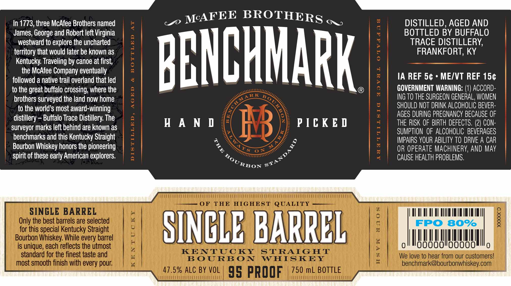

# TTB COLA Label Images - TTBID 19319001000044

**Brand Name:** BENCHMARK

**Issue Date:** 12/18/2019

**Origin Code:** 22

**Product Class/Type:** 101

**Source:** [TTB Public COLA Registry](https://ttbonline.gov/colasonline/viewColaDetails.do?action=publicFormDisplay&ttbid=19319001000044)

## Label Images

### Label 1

## Extracted Label Text

*Text extracted via OCR - may contain errors*

**Detected Proof:** 95

### Label 1

In 1773, three McAfee Brothers named
BROTHERS
6
DISTILLED, AGED AND
James; George and Robert left Virginia
BOTTLED BY BUFFALO
westward to explore the uncharted
1
TRACE DISTILLERY;
territory that would later be known as
1
FRANKFORT, KY
Kentucky: Traveling by canoe at first;
BBHCHHARK
the McAfee Company eventually
followed a native trail overland that led
0
:
IA REF 5c
ME/VT REF 15c
to the great buffalo crossing; where the
8
GOVERNMENT WARNING: (1) ACCORD-
brothers surveyed the land now home
1
RK
ING TO THE SURGEON GENERAL, WOMEN
to the world $ most award-winning
6
SHOULD NOT DRINK ALCOHOLIC BEVER-
distillery
Buffalo Trace Distillery The
0
AGES DURING PREGNANCY BECAUSE OF
surveyor marks left behind are known as
H A N D
HB
PIC K E D
THE RISK OF BIRTH DEFECTS, (2) CON-
SUMPTION  OF ALCOHOLIC   BEVERAGES
benchmarks and this Kentucky Straight
1

IMPAIRS YOUR ABILITY TO DRIVE A CAR
Bourbon Whiskey honors the pioneering
OR OPERATE MACHINERV, AND May
spirit of these early American explorers:
CAUSE HEALTH PROBLEMS,
F
THE
HIGHEST
QUALITY
SINGLE BARREL
Only the best barrels are selected
:
1
FPO 80%
8
for this special Kentucky Straight
P
SINBLE BARREL
Bourbon Whiskey: While every barrel
is unique; each reflects the utmost
F
2
00
2
KENTUCKY
STRAIG HT
standard for the finest taste and
tn
We love to hear from our customersl
most smooth finish with every pour:
2
B OURB ON
WHISKEY
3
benchmark@bourbonwhiskey com
47.5% ALC BY VOL
95 PROOF
750 mL BOTTLE
McAFEE
1
STANDARD
KOURBO
