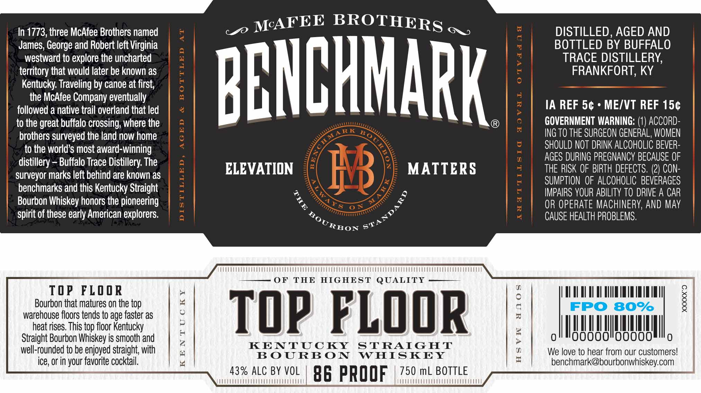

# TTB COLA Label Images - TTBID 19319001000048

**Brand Name:** BENCHMARK

**Issue Date:** 12/18/2019

**Origin Code:** 22

**Product Class/Type:** 101

**Source:** [TTB Public COLA Registry](https://ttbonline.gov/colasonline/viewColaDetails.do?action=publicFormDisplay&ttbid=19319001000048)

## Label Images

### Front Label

## Extracted Label Text

*Text extracted via OCR - may contain errors*

### Front Label

le

BS

In 1773, three McAfee Brothers named

_o MAFEE BROTHERs

DISTILLED, AGED AND

BOTTLED BY BUFFALO

James, George and Robert left Virginia

westward to explore the uncharted

TRACE DISTILLERY,

territory that would later be known as

FRANKFORT, KY

Kentucky. Traveling by canoe at first,

the McAfee Company eventually

IA REF 5¢ » ME/VT REF 15¢

followed a native trail overland that led

to the great buffalo crossing, where the

BENCHMARK

GOVERNMENT WARNING: (1) ACCORD-

brothers surveyed the land now home

ING TO THE SURGEON GENERAL, WOMEN

fo the world’s most award-winning

SHOULD NOT DRINK ALCOHOLIC BEVER-

AGES DURING PREGNANCY BECAUSE OF

distillery — Buffalo Trace Distillery. The

ELEVATION

MATTERS

THE RISK OF BIRTH DEFECTS. (2) CON-

surveyor marks left behind are known as

SUMPTION OF ALCOHOLIC BEVERAGES

benchmarks and this Kentucky Straight

IMPAIRS YOUR ABILITY TO DRIVE A CAR

Bourbon Whiskey honors the pioneering

OR OPERATE MACHINERY, AND MAY

spirit of these early American explorers.

CAUSE HEALTH PROBLEMS.

Ron s*”

MUM

OF THE HIGHEST QUALITY

TOP FLOOR

D

9 |

oO

TAL TAL AY M1 HT

lt

Ill

xs |

Bourbon that matures on the top

warehouse floors tends to age faster as

a

|

|

heat rises. This top floor Kentucky

TOP FLOOR

WALA

|

UML

Straight Bourbon Whiskey is smooth and

4

KENTUCKY STRAIGHT

alll

00000

00000

ll,

well-rounded to be enjoyed straight, with

BOURBON WHISKEY

We love to hear from our customers!

|

ice, or in your favorite cocktail.

id

|

benchmark@bourbonwhiskey.com

43% ALC BY VOL

750 mL BOTTLE

ARUUAMO MMMM ARRO AMMO UOO NOR UO ORO

86 PROOF

FOU EEE
