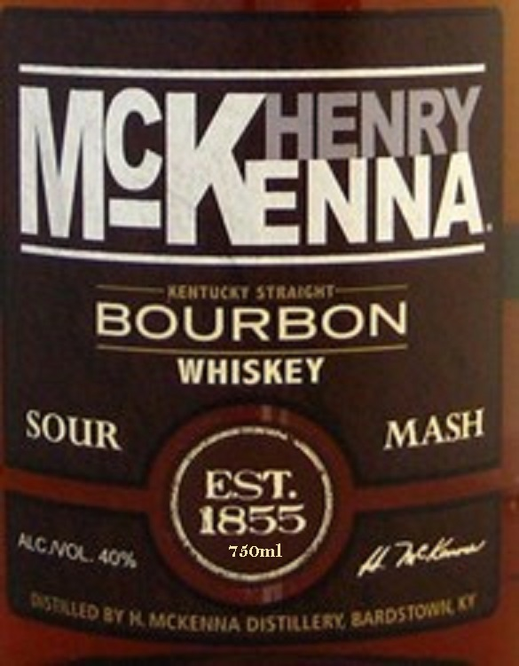
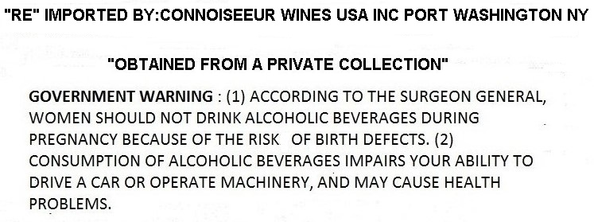

# TTB COLA Label Images - TTBID 19336001001130

**Brand Name:** HENRY MCKENNA

**Issue Date:** 12/17/2019

**Origin Code:** 22

**Product Class/Type:** 192

**Source:** [TTB Public COLA Registry](https://ttbonline.gov/colasonline/viewColaDetails.do?action=publicFormDisplay&ttbid=19336001001130)

## Label Images

### Label 1

### Label 2

## Extracted Label Text

*Text extracted via OCR - may contain errors*

### Label 1

HENRY
McKENA
mtuciaina
BOURBON
WHISKEY
EST
1855
Jor
750ml
TeT KM*CKENMA distillest
SOUR
MASH
CNU
4xa~
Aetos
Maadsion

### Label 2

"RE
IMPORTED BY:CONNOISEEUR WINES USA INC PORT WASHINGTON NY
"OBTAINED FROM A PRIVATE COLLECTION'
GOVERNMENT WARNING
(1) ACCORDING TO THE SURGEON GENERAL,
WOMEN SHOULD NOT DRINK ALCOHOLIC BEVERAGES DURING
PREGNANCY BECAUSE OF THE RISK
OF BIRTH DEFECTS. (2)
CONSUMPTION OF ALCOHOLIC BEVERAGES IMPAIRS YOUR ABILITY TO
DRIVE A CAR OR OPERATE MACHINERY, AND MAY CAUSE HEALTH
PROBLEMS.
