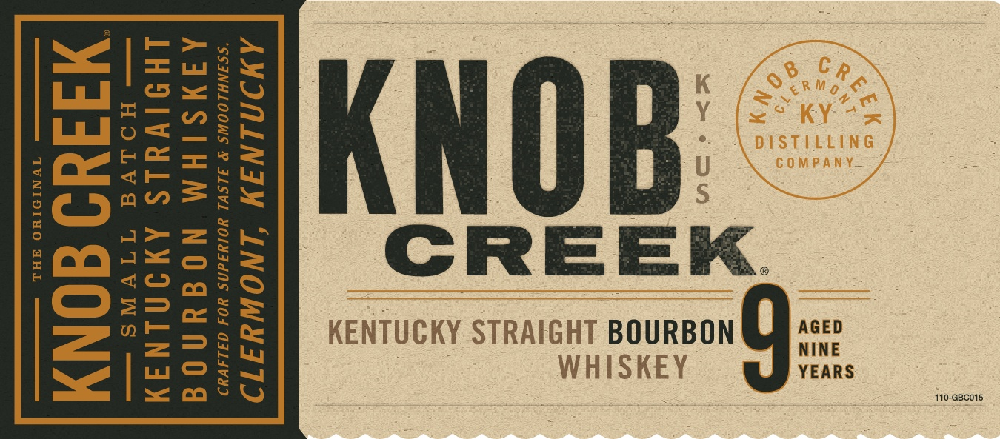
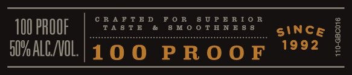
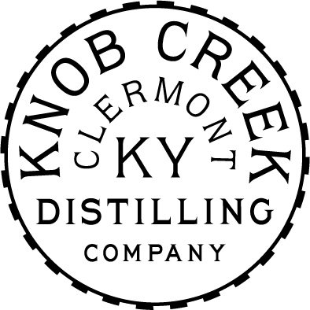
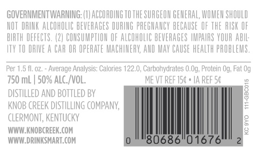

# TTB COLA Label Images - TTBID 19340001000134

**Brand Name:** KNOB CREEK

**Issue Date:** 12/26/2019

**Origin Code:** 22

**Product Class/Type:** 101

**Source:** [TTB Public COLA Registry](https://ttbonline.gov/colasonline/viewColaDetails.do?action=publicFormDisplay&ttbid=19340001000134)

## Label Images

### Label 1

### Label 2

### Label 3

### Label 4

### Label 5

## Extracted Label Text

*Text extracted via OCR - may contain errors*

*2 image(s) excluded: text did not meet readability threshold*

### Label 1

AMINININ INOWHITD

“SSINHLOOWS ® FLSVL HOIWTdNS HOA GILAVAD

AAJYSIHM NOGUNO|G
LHOIWYLS AWININAY

—— HO Vo

¥idu0 dONy

IVNIDIHO FHL

110-aB0015

### Label 4

AMIUMINIWY LNOWYIAT9

Sistilleg «
Umire in
Wangs; ties

CRE rat batdh

### Label 5

GOVERNMENTWARNING: (}) ACCORDING TO THE SURGEON GENERAL, WOMEN SHOULD
NOT ORINK ALCOHOLIC BEVERAGES DURING PREGNANCY BECAUSE OF THE RISK OF
BIRTH DEFECTS. (2) CONSUMPTION OF ALCONOLIC BEVERAGES IMPAIRS YOUR ABIL
ITY TO ORIVE A CAR OR OPERATE MACHINERY, AND MAY CAUSE HEALTH PROBLEMS
Per 1.5 fl.oz. - Average Analysis: Calories 122.0, Carbohydrates 0.09, Protein Og, Fat 0g
750 mL | 50% ALC./VOL. MEVTREFIS( +IAREFS¢
DISTILLED AND BOTTLED BY Hy
KNOB CREEK DISTILLING COMPANY, E
CLERMONT, KENTUCKY g
WWW.KNOBCREEK.COM ig
WWW.DRINKSMART.COM
