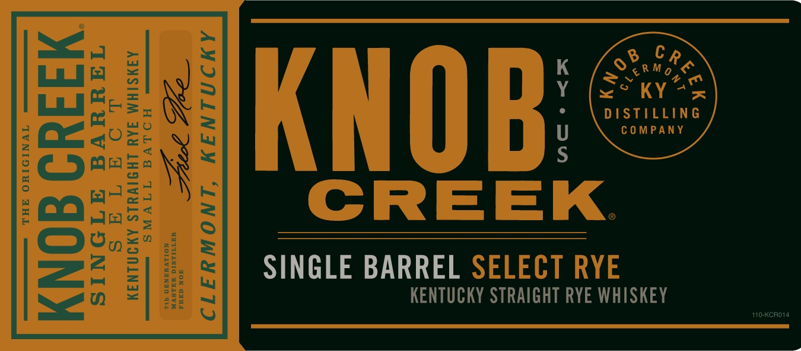
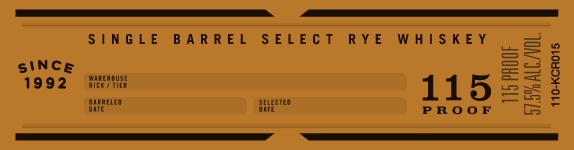
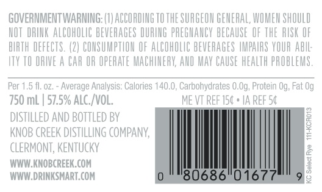

# TTB COLA Label Images - TTBID 19340001000157

**Brand Name:** KNOB CREEK

**Issue Date:** 12/11/2019

**Origin Code:** 22

**Product Class/Type:** 102

**Source:** [TTB Public COLA Registry](https://ttbonline.gov/colasonline/viewColaDetails.do?action=publicFormDisplay&ttbid=19340001000157)

## Label Images

### Label 1

### Label 2

### Label 3

### Label 4

## Extracted Label Text

*Text extracted via OCR - may contain errors*

*3 image(s) excluded: text did not meet readability threshold*

**Detected Proof:** 115

### Label 3

GOVERNMENTWARNING: (8] ACCORDING TO THE SURGEON GENERAL, WOMEM SHOULD
NOT  DRINK ALCOHOLIC BEVERAGES DURLNG PREGNANCY BECAUSE OF ThE  RUSK OF
BIRTH DEFECTS. (2| COMSUMPTHOM OF ALCOHOLC BEVERAGES HMPAUAS VOUR AbIL;
ITX TO DRIE
CAR OR OPERATE MACHINERV, AND Mav CAUSE HEALTH PROBLEMS;
Per 1,5 fl, 0z,
Average Analysis: Calories 140.0 , Carbohydrates 0.Og, Protein Og; Fat Og
'750 mL
57.5% Alc_ /VOL;
ME VT REF 154 * IA REF 54
distILleD AND BOTTLED BY
KNOB CReEK DISTILLING COMPANY;
1
CLeRMONT, KeNTUCKY
WUW KNOBCREEK COM
2
WUW.DRINKSMART. COM
'80686"0167
g
