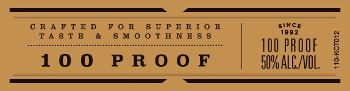
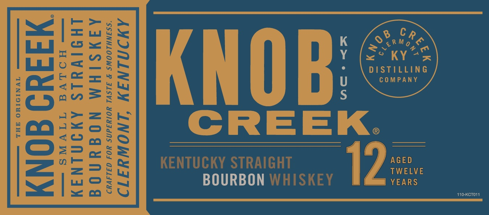
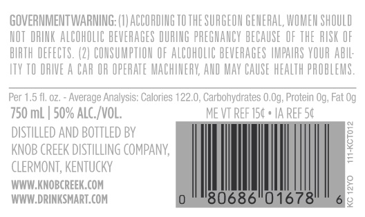

# TTB COLA Label Images - TTBID 19340001000173

**Brand Name:** KNOB CREEK

**Issue Date:** 12/16/2019

**Origin Code:** 22

**Product Class/Type:** 101

**Source:** [TTB Public COLA Registry](https://ttbonline.gov/colasonline/viewColaDetails.do?action=publicFormDisplay&ttbid=19340001000173)

## Label Images

### Label 1

### Label 2

### Label 3

### Label 4

### Label 5

## Extracted Label Text

*Text extracted via OCR - may contain errors*

*4 image(s) excluded: text did not meet readability threshold*

**Detected Proof:** 100

### Label 5

GOVERNMENTWARNING: (8] ACCORDING TO THE SURGEON GENERAL, WOMEM SHOULD
NOT  DRINK ALCOHOLIC BEVERAGES DURLNG PREGNANCY BECAUSE OF ThE  RISK OF
BIRTH DEFECTS. (2| COMSUMPTLOM OF ALCOHOLC BEVERAGES VMPAUAS VOUR AbIL;
ITY TO DRIE A CAR OR OPERATE MACHINERV AND MAY CAUSE HEALTH PROBLEMS
Per 1,5 fl, 0Z,
Average Analysis: Calories 122.0, Carbohydrates 0,Og; Protein Og, Fat Og
750 mL | 50% Alc_/VOL;
ME VT REF 154 * IA REF 54
dstiLled AND BOTTLED BY
KNOB CReEK DISTILLING COMPANY;
1
CLERMONT, KeNTUCKY
WWW KNOBCREEK COM
2
WWW.DRINKSMART. COM
'80686
01678
