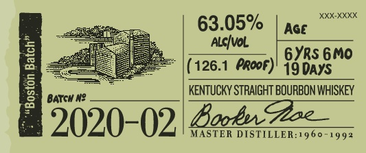

# TTB COLA Label Images - TTBID 19343001000045

**Brand Name:** BOOKER'S

**Issue Date:** 12/12/2019

**Origin Code:** 22

**Product Class/Type:** 101

**Source:** [TTB Public COLA Registry](https://ttbonline.gov/colasonline/viewColaDetails.do?action=publicFormDisplay&ttbid=19343001000045)

## Label Images

### Label 1

### Label 2

### Label 3

### Label 4

## Extracted Label Text

*Text extracted via OCR - may contain errors*

*2 image(s) excluded: text did not meet readability threshold*

### Label 1

booker

Bho Wibuy tm shea frchege Ae

(es

mila

Satta sper tds ur fll

Wy rm o lin Loan bh his

eee, || == |

PEN LES epens

s<¢e

barrel tured.

cened jlo .

### Label 2

63.05% 7000
VoL sano
(126.1 PRoor) phseio

19 Days

KENTUCKY STRAIGHT BOURBON WHISKEY

a 5020-02 Gorden Poe

Boston Batch”
