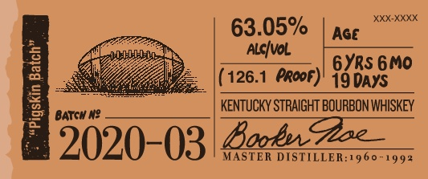

# TTB COLA Label Images - TTBID 19343001000051

**Brand Name:** BOOKER'S

**Issue Date:** 12/12/2019

**Origin Code:** 22

**Product Class/Type:** 101

**Source:** [TTB Public COLA Registry](https://ttbonline.gov/colasonline/viewColaDetails.do?action=publicFormDisplay&ttbid=19343001000051)

## Label Images

### Label 1

### Label 2

### Label 3

### Label 4

## Extracted Label Text

*Text extracted via OCR - may contain errors*

*1 image(s) excluded: text did not meet readability threshold*

**Detected Proof:** 126.1
**Detected Age:** 6 Years

### Label 1

BBooenh
@he
wn Ho packoae _
The
Mlght gpadebrunbon-chabz
1
"zaashon -andoenean |
1
my gndfath-fm Zoam Dstha
Whuksfron d Ro eigtt _
022,
ZS0ML
Erker? 3urbh4
"fazhftnlel
remobe mnly pieces _
banelband
124-/420-
9fisbt ~
~Ga (

### Label 2

XXX-
63.05%
Age
AlcIval
1
6YRs 6Mo
126.1
Proof)' 19 DAYS
1
BATGH N?
KENTUCKY STRAIGHT BOURBON WHISKEY
2020-03| BaEz;
MASTER DISTILLER:1960 -
992

### Label 3

BOOKER'Se KENTUCKY STRAIGHT BOURBON WHISKEY
DISTILLED AND BOTTLED BY JAMES B. BEAM DISTILLING CO_
CLERMONT, KENTUCKY
GOVERNMENT WARNING: C
ACCORDIHG TO
THE   SURGEOH  GENERAL, WOMEN   ShOuLI
NOT DRNKALCOHOLIC BEVERAGES DUFIG
PREGHANCY
BECAUSE
OF
THE
RISK
OF BIRTH defects. (2| COMSUMPTLON OF
AlCOhOlC BEVERAGES   IMPAIRS  YOUR
abiLty TO DRIVE A CAR OR OPERATE MAChI:
ERK, AND  MAY  CAUSE  health  PROBLEMS ,
80686"01140'
ME VT REF [Sc + IA REF Sc
124-2455-A
