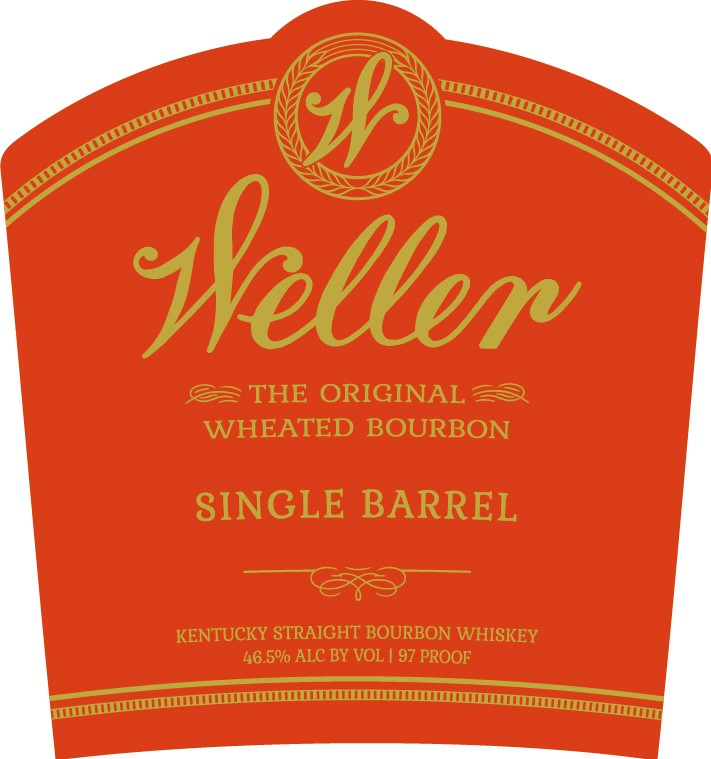
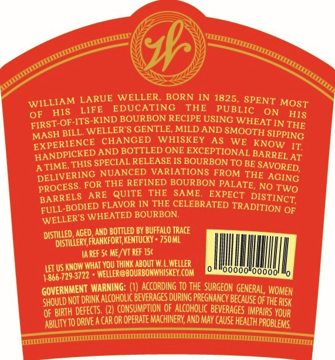

# TTB COLA Label Images - TTBID 19344001000045

**Brand Name:** WELLER

**Issue Date:** 12/13/2019

**Origin Code:** 22

**Product Class/Type:** 101

**Source:** [TTB Public COLA Registry](https://ttbonline.gov/colasonline/viewColaDetails.do?action=publicFormDisplay&ttbid=19344001000045)

## Label Images

### Label 1

### Label 2

## Extracted Label Text

*Text extracted via OCR - may contain errors*

*1 image(s) excluded: text did not meet readability threshold*

### Label 1

al \7

oot

oy zs

SS

\y

ay,

SS

\)

s

ss

Ss

s

ee,

Wellem

THE ORIGINAL

WHEATED BOURBON

SINGLE BARREL

KENTUC!

<Y STRAIGHT BOURBON WHISI

KEY

46.50% ALC BY VOL | 97 PROOF

er

AEE EEOC

————
