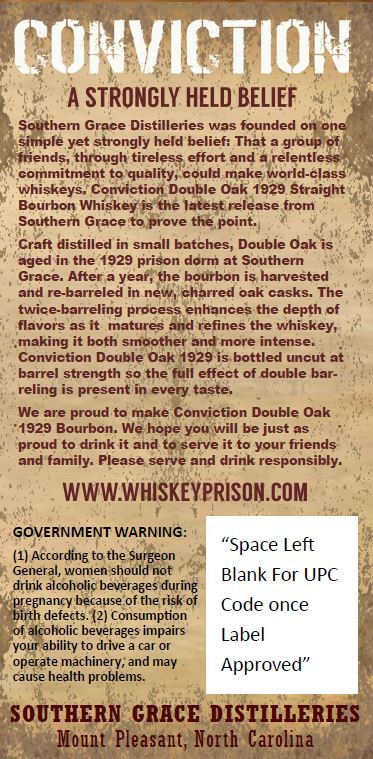
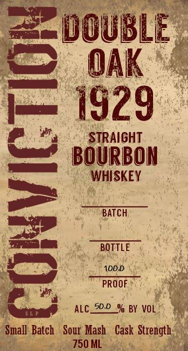
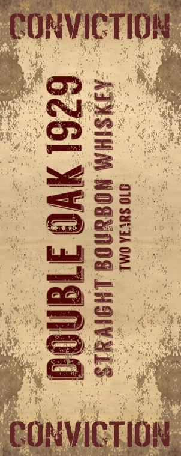
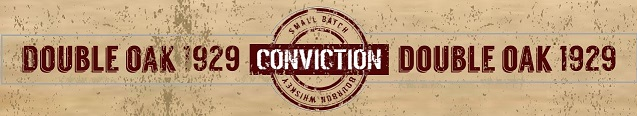

# TTB COLA Label Images - TTBID 20008001000083

**Brand Name:** CONVICTION DOUBLE OAK 1929 SMALL BATCH BOURBON

**Issue Date:** 01/28/2020

**Origin Code:** 35

**Product Class/Type:** 101

**Source:** [TTB Public COLA Registry](https://ttbonline.gov/colasonline/viewColaDetails.do?action=publicFormDisplay&ttbid=20008001000083)

## Label Images

### Back Label

### Front Label

### Label 2

### Label 4

## Extracted Label Text

*Text extracted via OCR - may contain errors*

### Back Label

COnvICTION
STRONGLY HELD BELIEF
Southern Grace Distilleries was founded on one
simple yet strongly held belief: That
group of
friends, through tireless effort and
relentless
commitment to quality; could make world-class
whiskeys
Conviction Double Oak 1929 Straight
Bourbon
Whiskey is the latest release from
Southern Grace to prove the point:
Craft distilled in small batches; Double Oak is
aged in the 1929 prison dorm at Southern
Grace. After
ear; the bourbon is harvested
and re-barreled in new
charred oak casks
The
twice-barreling process enhances the depth of
flavors asit
matures and refines the whiskey;
making it both smoother and more intense_
Conviction Double Oak 1929 is bottled uncut at
barrel strength so the full effect of double bar-
reling is present in every taste
We are proud to make Conviction Double Oak
1929 Bourbon. We hope you will be just as
proud to drink it and to serve it to your friends
and family: Please serve and drink responsibly
WWWWHISKEYPRISON COM
GOVERNMENT WARNING:
"Space Left
(1) According to the Surgeon
General, women should not
Blank For UPC
drink alcoholic beverages during
pregnancy because of the risk of
Code once
birth defects. (2] Consumption
of alcoholic beverages impairs
Label
your ability to drive
car Or
operate machinery; and may
Approved"
cause health problems.
SOUTHERN GRACE DISTILLERIES
Mount Pleasant; North Carolina

### Front Label

ae

cam DOUBLE

OAK *

1929

| aa

STRAIGHT

BOURBON

WHISKEY

BATCH

ee a

BOTTLE

100.D

a,

PROOF

i

ALC_20-2_% BY VOL

I Batch Sour Mash. Cask Stre

### Label 2

po. pally Neh pally Che,
TONVICTION
ye ENE oe
Bie lp) Meo
ey es
A: mama Jayde >
ne
2 ee
epee
Se
S55
poe ar aa
we nll oad
Oz
Py => Qo... Gee
baie bm" 5 aaa a
ae Oe 5 Se
aes
pM ken ie ab RY
CONVICTION
CORVIG HOR

### Label 4

DOUBLE OAK 1929 FETT DOUBLE OAK 1929
