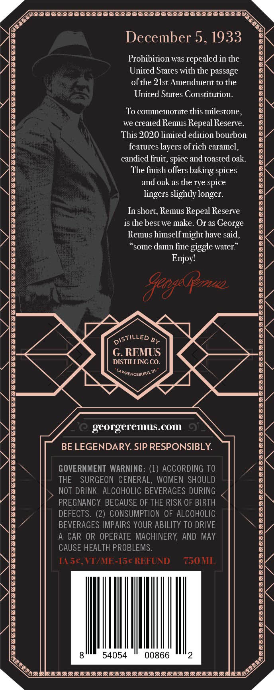
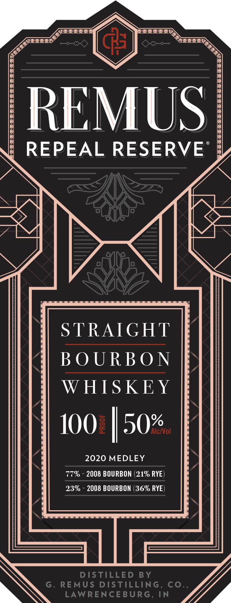

# TTB COLA Label Images - TTBID 20023001000276

**Brand Name:** REMUS

**Fanciful Name:** REPEAL RESERVE

**Issue Date:** 02/13/2020

**Origin Code:** 22

**Product Class/Type:** 101

**Source:** [TTB Public COLA Registry](https://ttbonline.gov/colasonline/viewColaDetails.do?action=publicFormDisplay&ttbid=20023001000276)

## Label Images

### Back Label

### Front Label

### Label 3

## Extracted Label Text

*Text extracted via OCR - may contain errors*

### Back Label

SIT CCST TTC CV NC TV VT TT RST

ys

.>

\

er

%

December 5, 1933

Prohibition was repealed in the

United States with the passage

of the 21st Amendment to the

United States Constitution.

To commemorate this milestone,

we created Remus Repeal Reserve.

\\s

This 2020 limited edition bourbon

features layers of rich caramel,

\\e

candied fruit, spice and toasted oak.

J \@

The finish offers baking spices

and oak as the rye spice

lingers slightly longer.

In short, Remus Repeal Reserve

is the best we make. Or as George

Remus himself might have said,

“some damn fine giggle water.”

Enjoy!

AGE 2

ASTILLED p>

G. REMUS

DISTILLING CO.

BIN

“shmencesure™

georgeremus.com

BE LEGENDARY. SIP RESPONSIBLY.

GOVERNMENT WARNING: (1) ACCORDING TO

THE SURGEON GENERAL, WOMEN SHOULD

NOT DRINK ALCOHOLIC BEVERAGES DURING

PREGNANCY BECAUSE OF THE RISK OF BIRTH

DEFECTS. (2) CONSUMPTION OF ALCOHOLIC

BEVERAGES IMPAIRS YOUR ABILITY TO DRIVE

A CAR OR OPERATE MACHINERY, AND MAY

CAUSE HEALTH PROBLEMS,

[A5¢€

VI/ME

5¢ REFUND

750 MI

8

54054

00866

2

Rey

Ry

By

> Revel PIIIIIIGILUIILIIOIIIIIVIGIIII Aso

a

### Front Label

{BULLS

er

a

a

>

MUS

RE

REPEAL RESERVE’

NIN

Wi

7

le

INZIES

an

STRAIGHT

BOURBON

WHISKEY

100.

a0%

2020 MEDLEY

77% - 2008 BOURBON (21% RYE)

23% - 2008 BOURBON (36% RYE)

WN

Vg

### Label 3

QQ

LOWS

K2

REPEAL

SERIES
