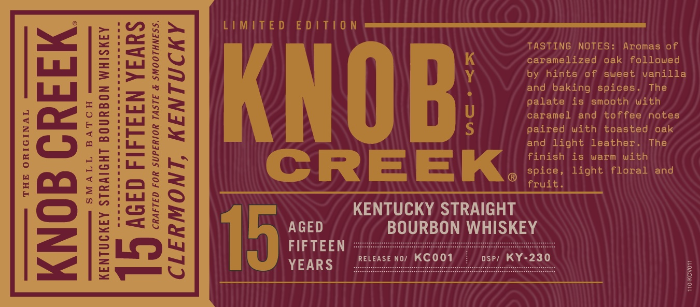

# TTB COLA Label Images - TTBID 20044001000129

**Brand Name:** KNOB CREEK

**Issue Date:** 02/28/2020

**Origin Code:** 22

**Product Class/Type:** 101

**Source:** [TTB Public COLA Registry](https://ttbonline.gov/colasonline/viewColaDetails.do?action=publicFormDisplay&ttbid=20044001000129)

## Label Images

### Label 1

### Label 2

### Label 3

### Label 4

### Label 5

## Extracted Label Text

*Text extracted via OCR - may contain errors*

### Label 1

ne)

:a

TASTING NOTES

Aromas of

caramelized oak followed

by hints of sweet vanilla

ina |

and baking spices

The

palate is smooth with

caramel and toffee notes

KNOB:

paired with toasted oak

and light leather

The

finish is warm with

YS

spice, light floral and

CREEK.

fruit

a=)

KENTUCKY STRAIGHT

He

AGED

BOURBON WHISKEY

FIFTEEN

-Loo

RELEASE No/ KCOO1

osr/ KY-230

19

YEARS

Sev

### Label 2

LIMITED EDITIO

Soon

s

o

100 PROOF

§

g

100 PROOF

SOM ALCO.

### Label 3

|

|

|

|

te)

80686

01689

2

### Label 4

Sa

SRM a

eo KY “5

DISTILLING

COMPANY

### Label 5

AMIUMINGIY

1NOWYIT19

distil.

d in

Umire,

'D

TWantitig,

CREEK

sMALL

batch
