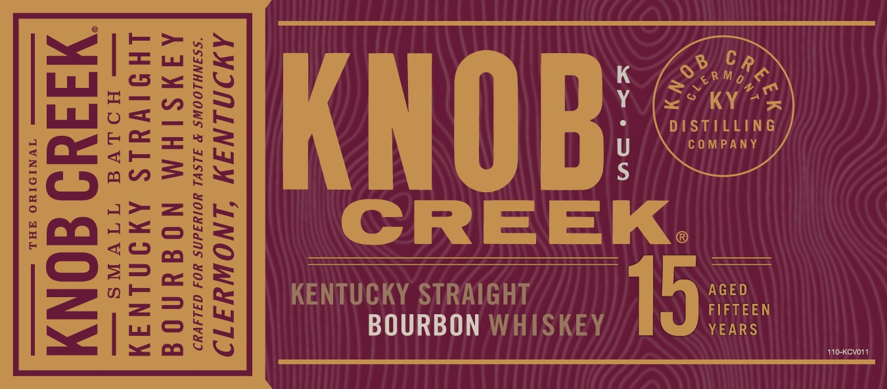
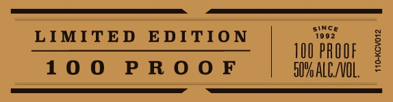
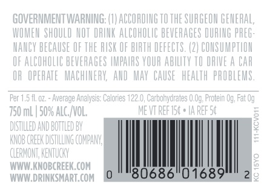

# TTB COLA Label Images - TTBID 20044001000139

**Brand Name:** KNOB CREEK

**Issue Date:** 03/01/2020

**Origin Code:** 22

**Product Class/Type:** 101

**Source:** [TTB Public COLA Registry](https://ttbonline.gov/colasonline/viewColaDetails.do?action=publicFormDisplay&ttbid=20044001000139)

## Label Images

### Label 1

### Label 2

### Label 3

### Label 4

### Label 5

## Extracted Label Text

*Text extracted via OCR - may contain errors*

### Label 1

me [EGS

2y

Sama}

<° KY -

buo=2ik

DISTILLING

cats

COMPANY

a3 za

KNOB

= wt

GCA Aax~ct=

qo

CREEK.

29

ne

=)

cme

AGED

=>:

KENTUCKY STRAIGHT

FIFTEEN

mOcwy

BOURBON WHISKEY

19

YEARS

Y=)

410-Kevor:

### Label 2

LIMITED EDITIO

Soon

s

o

100 PROOF

§

g

100 PROOF

SOM ALCO.

### Label 3

Sa

SRM a

eo KY “5

DISTILLING

COMPANY

### Label 4

AMIUMINGIY

1NOWYIT19

distil.

d in

Umire,

'D

TWantitig,

CREEK

sMALL

batch

### Label 5

|

|

|

|

te)

80686

01689

2
