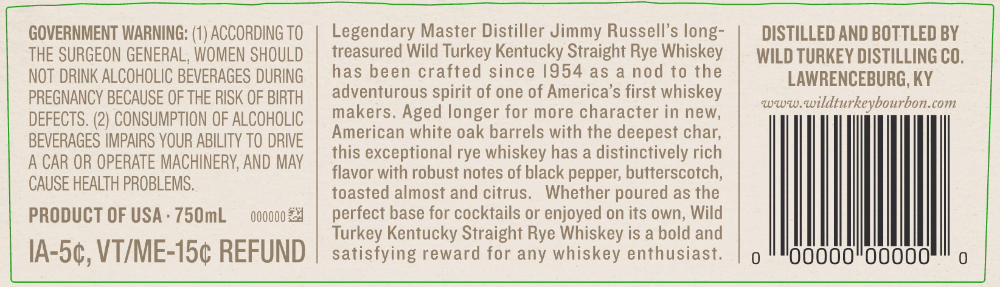
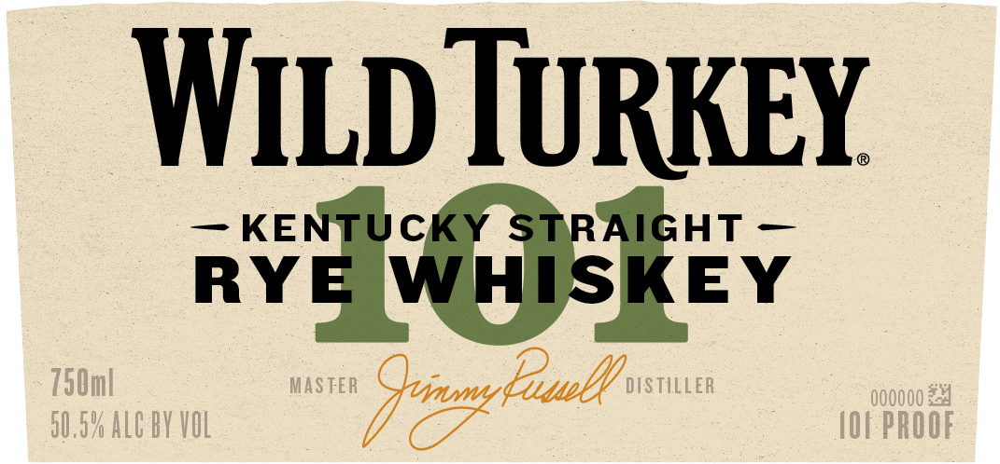
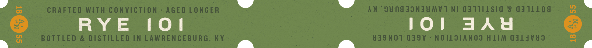
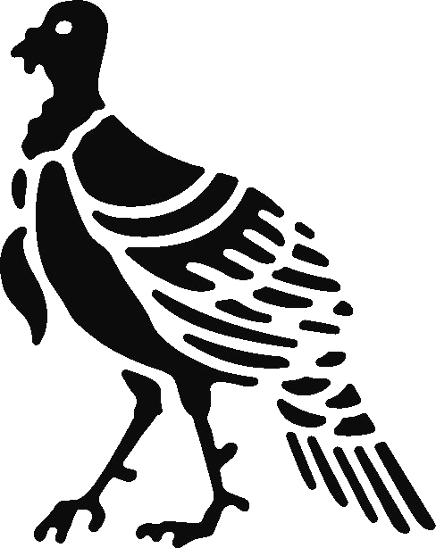

# TTB COLA Label Images - TTBID 20044001000711

**Brand Name:** WILD TURKEY

**Fanciful Name:** 101 RYE

**Issue Date:** 02/28/2020

**Origin Code:** 22

**Product Class/Type:** 102

**Source:** [TTB Public COLA Registry](https://ttbonline.gov/colasonline/viewColaDetails.do?action=publicFormDisplay&ttbid=20044001000711)

## Label Images

### Back Label

### Front Label

### Label 3

### Label 4

### Label 5

### Label 6

## Extracted Label Text

*Text extracted via OCR - may contain errors*

*4 image(s) excluded: text did not meet readability threshold*

### Back Label

GOVERNMENT WARNING: (1) ACCORDING TO
Legendary Master Distiller Jimmy Russell's long-
DISTILLED AND BOTTLED BY
THE SURGEON GENERAL, WOMEN SHOULD
treasured Wild Turkey Kentucky Straight Rye Whiskey
WILD TURKEY DISTILLING CO,
NOT DRINK ALCOHOLIC BEVERAGES DURING
has been crafted since /954 as
a nod to the
LAWRENCEBURG, KY
PREGNANCY BECAUSE OF THE RISK OF BIRTH
adventurous spirit of one of America's first whiskey
zww
wildturkeybourbon.com
DEFECTS. (2) CONSUMPTION OF ALCOHOLIC
makers. Aged longer for more character in new,
BEVERAGES IMPAIRS YOUR ABILITY TO DRIVE
American white oak barrels with the deepest char;
this exceptional rye whiskey has a distinctively rich
A CAR OR OPERATE MACHINERV, AND MAy
flavor with robust notes of black pepper; butterscotch;
CAUSE HEALTH PROBLEMS .
toasted almost and citrus.
Whether poured as the
PRODUCT OF USA
750mL
OOOOOO
perfect base for cocktails or enjoyed on its own, Wild
Turkey Kentucky Straight Rye Whiskey is a bold and
IA-50, VTIME-15c REFUND
satisfying reward for any whiskey enthusiast.
00

### Front Label

WLd TURKEY
KENTUCKY STRAIGHT
RYE
WHISKEY
750m|
MASTER
uys
EeueQ
DISTILLER
00000024
50.59 ALC BY VOL
IOI PROOF
