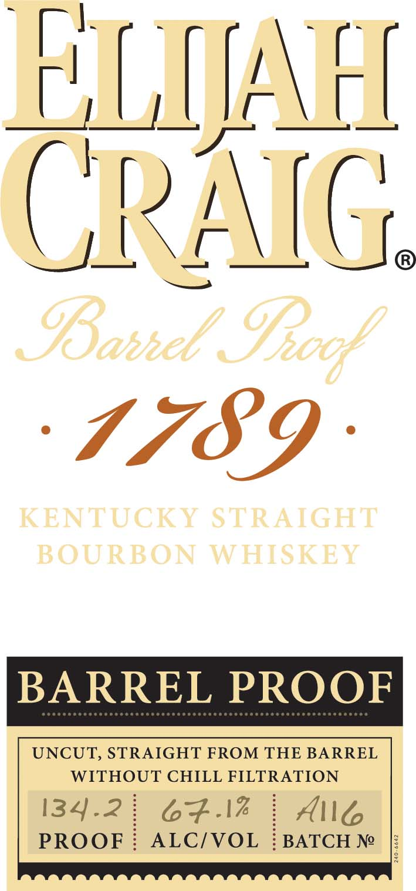
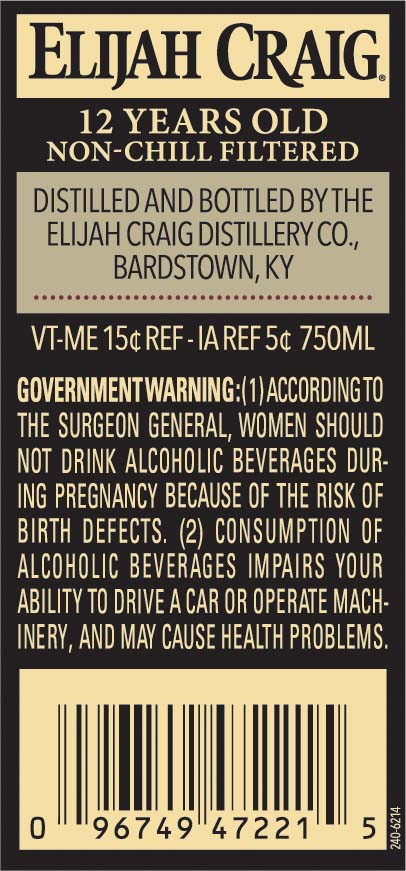

# TTB COLA Label Images - TTBID 20052001000181

**Brand Name:** ELIJAH CRAIG

**Fanciful Name:** BARREL PROOF

**Issue Date:** 03/05/2020

**Origin Code:** 22

**Product Class/Type:** 101

**Source:** [TTB Public COLA Registry](https://ttbonline.gov/colasonline/viewColaDetails.do?action=publicFormDisplay&ttbid=20052001000181)

## Label Images

### Back Label

### Label 2

### Label 3

### Label 4

## Extracted Label Text

*Text extracted via OCR - may contain errors*

*2 image(s) excluded: text did not meet readability threshold*

**Detected Age:** 12 Years

### Back Label

EXLIJAFL
CPAIC
IBahhel
1789
KENTUCKY STRAIGHT
BOURBON
WHISKET
BARREL PROOF
UNCUT, STRAIGHT FROM THE BARREL
WITHOUT CHILL FILTRATION
134.2
67.17
Allt
PROOF
ALCIVOL
BATCH Ne
GRook

### Label 4

ELIJAH CRAIG

12 YEARS OLD

NON-CHILL FILTERED

DISTILLED AND BOTTLED BY THE

ELIJAH CRAIG DISTILLERY CO.,

BARDSTOWN, KY

teneeccecsceccececceeecsecececseesesseeee

VI-ME 15¢ REF-IAREF 5¢ 750ML

GOVERNMENTWARNING:(1)ACCORDINGTO

THE SURGEON GENERAL, WOMEN SHOULD

NOT DRINK ALCOHOLIC BEVERAGES DUR

ING PREGNANCY BECAUSE OF THE RISK OF

BIRTH DEFECTS. (2) CONSUMPTION OF

ALCOHOLIC BEVERAGES IMPAIRS YOUR

ABILITY T0 DRIVE A CAR OR OPERATE MACH

INERY, AND MAY CAUSE HEALTH PROBLEMS

Ill

|

749

|

221

|

.
