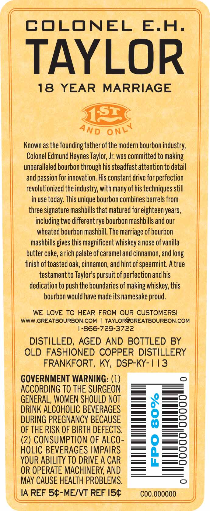
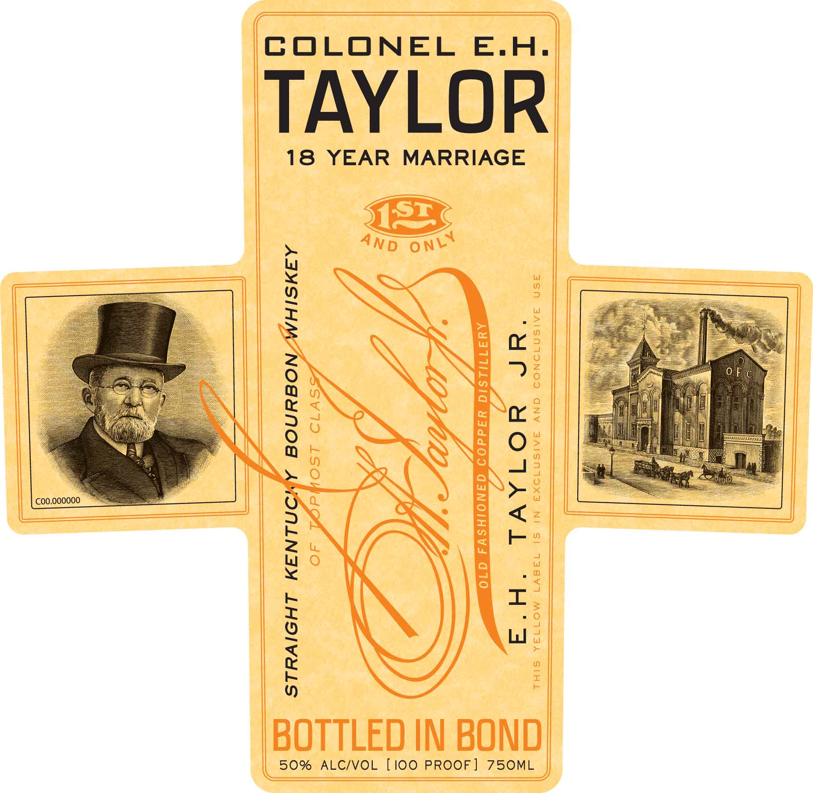
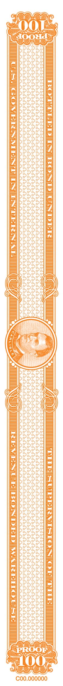

# TTB COLA Label Images - TTBID 20058001000234

**Brand Name:** COLONEL E.H. TAYLOR

**Issue Date:** 03/10/2020

**Origin Code:** 22

**Product Class/Type:** 101

**Source:** [TTB Public COLA Registry](https://ttbonline.gov/colasonline/viewColaDetails.do?action=publicFormDisplay&ttbid=20058001000234)

## Label Images

### Back Label

### Label 1

### Label 2

## Extracted Label Text

*Text extracted via OCR - may contain errors*

*2 image(s) excluded: text did not meet readability threshold*

**Detected Age:** 18 Years

### Back Label

COLONEL
E.A.
TAYLOR
18
YEAR
MARRIAGE
Known as the founding father of the modern bourbon industry;
Colonel Edmund Haynes Taylor; Jr was committed to making
unparalleled bourbon through his steadfastattention to detail
andpassion for innovation. His constant drive for perfection
revolutionized the industry; with many ofhis techniques still
in use today: This unique bourbon combines barrels from
three signature mashbills that matured for eighteen years,
including two differentrye bourbon mashbills and our
wheated bourbon mashbill. The marriage of bourbon
mashbills gives this magnificent whiskey a nose ofvanilla
butter cake, a rich palate ofcarameland cinnamon; and B
finish of toasted oak, cinnamon, and hint ofspearmint. A true
testament to Taylor's pursuit ofperfection and his
dedication to push the boundaries of making whiskey; this
bourbon would have made its namesake proud,
WE LOVE TO HEAR FROM OUR CUSTOMERSI
WWW,GREATBOURBON,COM
TAYLOR@GREATBOURBON,COM
1-866-729-3722
DISTILLED, AGED AND BOTTLED BY
OLD FASHIONED COPPER DISTILLERY
FRANKFORT, KY, DSP-KY-| 13
GOVERNMENT WARNING: (1)
0
ACCORDING TO THE SURGEON
GENERAL, WOMEN SHOULD NOT
DRINK ALCOHOLIC BEVERAGES
8
0
DURING PREGNANCY BECAUSE
OF THE RISK OF BIRTH DEFECTS,
(2) CONSUMPTION OF AlcO-
HOLIC BEVERAGES IMPAIRS
2
YOUR ABILITY TO DRIVE A CAR
OR OPERATE MACHINERY AND
May CAUSE HEALTH PROBLEMS.
IA REF 54-MEINT REF I54
COO.O0ooOO
Sr
ONLY
AND
long
