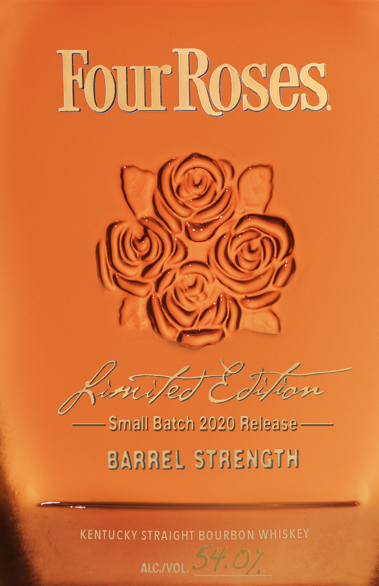
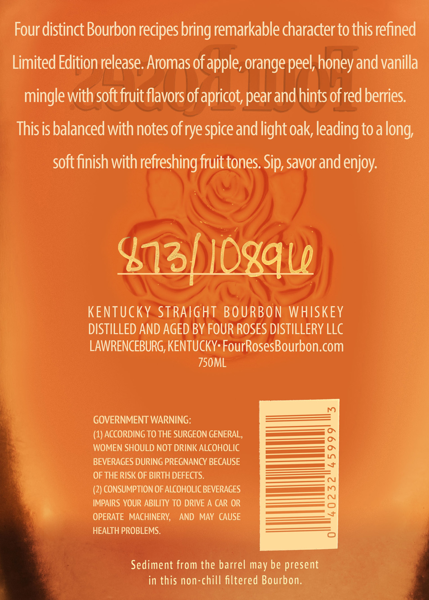
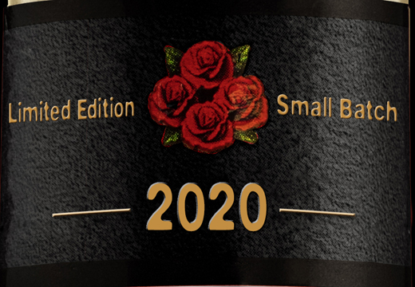

# TTB COLA Label Images - TTBID 20066001000945

**Brand Name:** FOUR ROSES

**Fanciful Name:** LIMITED EDITION SMALL BATCH

**Issue Date:** 03/18/2020

**Origin Code:** 22

**Product Class/Type:** 101

**Source:** [TTB Public COLA Registry](https://ttbonline.gov/colasonline/viewColaDetails.do?action=publicFormDisplay&ttbid=20066001000945)

## Label Images

### Label 1

### Label 2

### Label 3

## Extracted Label Text

*Text extracted via OCR - may contain errors*

### Label 1

—— Syulaill Seiten) 2020 slaloeise——
BARRE SiR eh Git

IGHT BOURBON WHISKEY

ee ALG/VOL. 54 O/

### Label 2

Four distinct Bourbon recipes bring remarkable character to this refined
Limited Edition release. Aromas of apple, orange peel, honey and vanilla
mingle with soft fruit flavors of apricot, pear and hints of red berries.
This is balanced with notes of rye spice and light oak, leading to a long,

soft finish with refreshing fruit tones. Sip, savor and enjoy.

les

KENTUCKY STRAIGHT BOURBON WHISKEY

DISTILLED AND AGED BY FOUR ROSES DISTILLERY LLC

LAWRENCEBURG, KENTUCKY: FourRosesBourbon.com
750ML

GOVERNMENT WARNING:

(1) ACCORDING TO THE SURGEON GENERAL,
WOMEN SHOULD NOT DRINK ALCOHOLIC

BEVERAGES DURING PREGNANCY BECAUSE

OF THE RISK OF BIRTH DEFECTS.

(2) CONSUMPTION OF ALCOHOLIC BEVERAGES

IMPAIRS YOUR ABILITY TO DRIVE A CAR OR

OPERATE MACHINERY, AND MAY CAUSE

HEALTH PROBLEMS.

Sediment from the barrel may be present
in this non-chill filtered Bourbon.

### Label 3

Loe
Limited Edition << £4) Small Bate
mited | oe 7) 9Mall Bat
as vd ONS i a
ASS Se
-— 2020-—=
