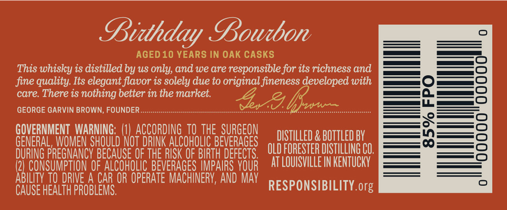
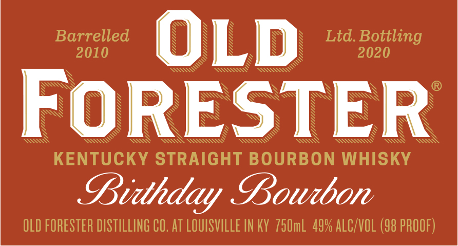
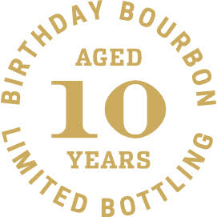
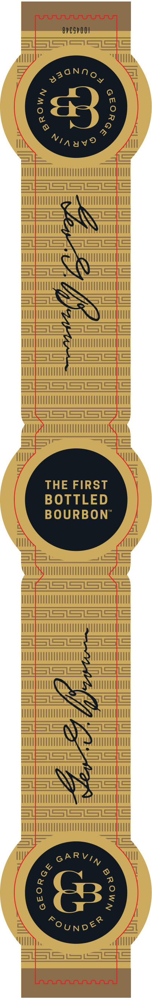

# TTB COLA Label Images - TTBID 20070001000451

**Brand Name:** OLD FORESTER

**Fanciful Name:** BIRTHDAY BOURBON 2020

**Issue Date:** 03/20/2020

**Origin Code:** 22

**Product Class/Type:** 101

**Source:** [TTB Public COLA Registry](https://ttbonline.gov/colasonline/viewColaDetails.do?action=publicFormDisplay&ttbid=20070001000451)

## Label Images

### Back Label

### Front Label

### Label 3

### Label 4

## Extracted Label Text

*Text extracted via OCR - may contain errors*

*2 image(s) excluded: text did not meet readability threshold*

**Detected Proof:** 98
**Detected Age:** 10 Years

### Back Label

Bidthday Bowtbon
AGED 10 YEARS IN OAK CASKS
This whisky is distilled by uS only, and we are responsible for its richness and
fine quality: Its elegant flavor is solely due to original fineness developed with
care. There is nothing better in the market.
8
GEORGE GARVIN BROWN, FOUNDER
6&hrw
1
GOVERNMENT  WARNING; (1) ACCORDING TO THE  SURGEON
DISTILLED & BOTTLED BY
GENERAL, WOMEN SHOuLD NOT DRINK ALCOHOLIC BEVERAGES
DURING PREGNANCY BECAUSE OF THE RISK OF BIRTH DEFECTS,
OLD FORESTER DISTILLING CO,
(2] CONSUMPTION OF ALCOHOLIC BEVERAGES IMPAIRS VOUR
AT LOUISVILLE IN KENTUCKY
ABILITY TO DRIVE A CAR OR OPERATE MACHINERY, AND Mav
CAUSE HEALTH PROBLEMS,
RESPONSIBILITY org

### Front Label

Barrelled
OLD
Ltd Bottling
2010
2020
FoRESTER
KENTUCKY STRAIGHT BOURBON WHISKY
Bidthday Bowtbon
OLD FORESTER DISTILLING CO, AT LOUISVILLE IN KY 75OmL 49% ALC/VOL (98 PROOF)
