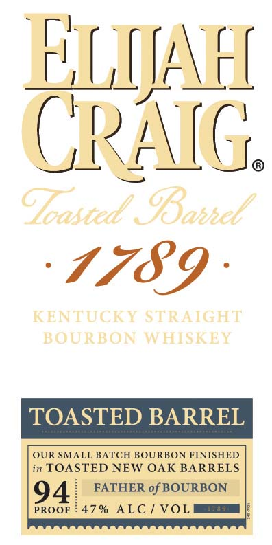
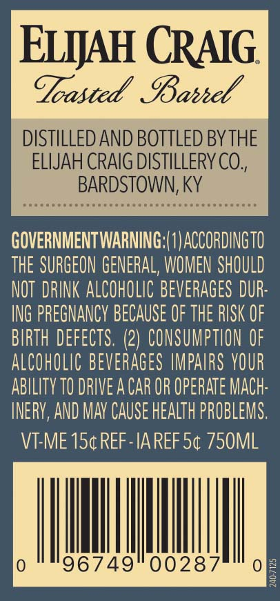

# TTB COLA Label Images - TTBID 20122001000174

**Brand Name:** ELIJAH CRAIG

**Fanciful Name:** TOASTED BARREL

**Issue Date:** 05/07/2020

**Origin Code:** 22

**Product Class/Type:** 101

**Source:** [TTB Public COLA Registry](https://ttbonline.gov/colasonline/viewColaDetails.do?action=publicFormDisplay&ttbid=20122001000174)

## Label Images

### Label 1

### Label 2

### Label 3

### Label 4

## Extracted Label Text

*Text extracted via OCR - may contain errors*

### Label 1

5

L

(

r

'

|

l

i

t

r

\

a=,

r

|

I

_

f

IK

\

=

a4.

==:

G.

‘S739 -

in TOASTED NEW OAK BARRELS

OUR SMALL BATCH BOURBON FINISHED

FATHER of BOURBON

PROOF 47% ALC / VOL =!

### Label 2

= ae

fo 4

y

—_

||

\

V/

J.

### Label 3

i

TOASTED BARREL

Tr

### Label 4

ELIJAH CRAIG

Toasted Barwdl

DISTILLED AND BOTTLED BY THE

ELIJAH CRAIG DISTILLERY CO.

BARDSTOWN, KY

GOVERNMENTWARNING:(1) ACCORDINGTO

THE SURGEON GENERAL, WOMEN SHOULD

NOT DRINK ALCOHOLIC BEVERAGES DUR

ING PREGNANCY BECAUSE OF THE RISK OF

BIRTH DEFECTS. (2) CONSUMPTION OF

ALCOHOLIC BEVERAGES IMPAIRS YOUR

ABILITY 10 DRIVE A CAR OR OPERATE MACH

INERY, AND MAY CAUSE HEALTH PROBLEMS

VT-ME 15¢ REF-IAREF 5¢ 750M

Il

|

|

|

96749

0028

|
