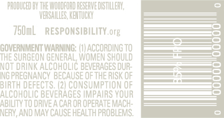
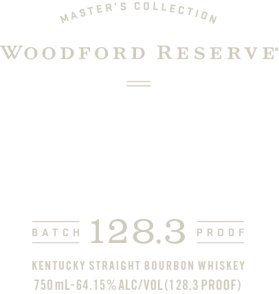

# TTB COLA Label Images - TTBID 20142001000451

**Brand Name:** WOODFORD RESERVE

**Fanciful Name:** MASTER'S COLLECTION BATCH PROOF

**Issue Date:** 05/27/2020

**Origin Code:** 22

**Product Class/Type:** 101

**Source:** [TTB Public COLA Registry](https://ttbonline.gov/colasonline/viewColaDetails.do?action=publicFormDisplay&ttbid=20142001000451)

## Label Images

### Back Label

### Front Label

### Label 3

## Extracted Label Text

*Text extracted via OCR - may contain errors*

### Back Label

‘PRODUCED BY THE WOODFORD RESERVE DISTILLERY,

TS0mL RESPONSIBILITY. org

THE SURGEON GENERAL, aoe ey

]OVERNMENT WARNING: (1) ACCORDING TO

—————Ss

—S— Ss

NOT DRINK ALCOHOLIC BEV

ING PREGNANCY BECAUSE ia “HE ARK oe

BIRTH DEFECTS. (2) CONSUMPTION OF

ALCOHOLIC BEVERAGES IMPAIRS YOUR

ABILITY TO DRIVE A CAR OR OPERATE MACH-

NERY, AND MAY CAUSE HEALTH PROBLEMS.

### Front Label

,sTeR’s COlLEecr,,

WOODFORD RESERVE

=

—

eatee 128.3 raoor

KENTUCKY STRAIGHT BOURBON WHISKEY

750 mL-64.15% ALC/VOL(128.3 PROOF)

### Label 3

BATCH

PROOF
