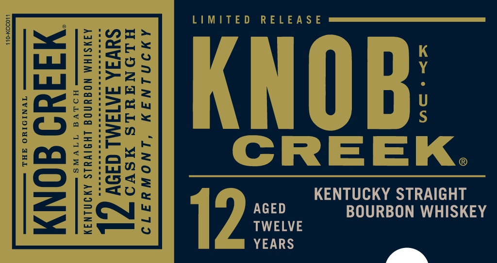
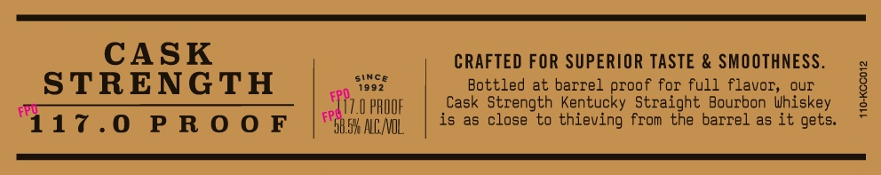
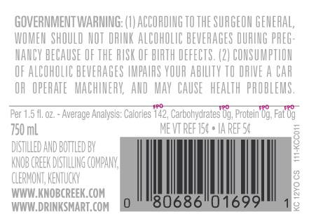

# TTB COLA Label Images - TTBID 20156001000277

**Brand Name:** KNOB CREEK

**Issue Date:** 06/10/2020

**Origin Code:** 22

**Product Class/Type:** 101

**Source:** [TTB Public COLA Registry](https://ttbonline.gov/colasonline/viewColaDetails.do?action=publicFormDisplay&ttbid=20156001000277)

## Label Images

### Label 1

### Label 2

### Label 3

### Label 4

### Label 5

## Extracted Label Text

*Text extracted via OCR - may contain errors*

*1 image(s) excluded: text did not meet readability threshold*

### Label 1

| ; me MO LIMITED RELEAS £
TNE LEIQED
i S2iae Ss K
Lud |= iOS Y
bay l2i7 4+ -
age te We
POS 22 Seu U
fe:c Bee S
2 [ ei | Seisn |
f--Feee CREEK
:2O Baty i » <
ans @
CS [2:0 < = | Eu
Soe KENTUCKY STRAIGHT
LS EN’ AGED BOURBON WHISKEY
~~ <8 TWELVE
YEARS
y, N

### Label 2

CASK

CRAFTED FOR SUPERIOR TASTE & SMOOTHNESS.

since

STRENGTH

1992

Bottled at barrel proof for full flavor, our

17.0 PROOF

Cask Strength Kentucky Straight Bourbon Whiskey

417.0 PROOF

7

Bok ACAOL

is as close to thieving from the barrel as it gets.

### Label 3

GOVERNMENT WARNING: (1) ACCORDING 10 THE SURGEON GENERAL

WOMEN SHOULD NOT DRINK ALCOHOLIC BEVERAGES DURING PREG

NANCY BECAUSE OF THE RISK OF BIRTH DEFECTS. (2) CONSUMPTION

OF ALCOHOLIC BEVERAGES IMPAIRS YOUR ABI

TO DRIVE A CAR

OR OPERATE MACHINERY, AND MAY CAUSE HEALTH PROBLEMS

er 1.5 fo

ries 142,

art

ig, Protein, Fat bg

750mL

MENT REF

FS

a

+ IAREFS¢

5

AND BOT!

Ki

ily

i

MPANY,

CRY

Www. IWOBCREK COM

A

WWW.DRINKSMART.COM

### Label 4

AMIUMINIWY LNOWYIAT9

Sistilleg «
Umire in
Wangs; ties

CRE rat batdh
