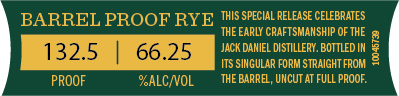
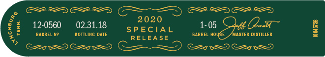
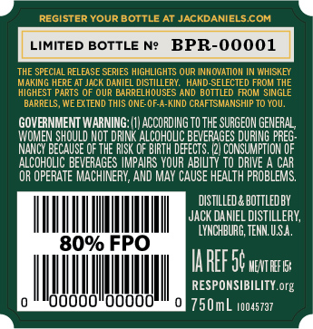

# TTB COLA Label Images - TTBID 20157001000656

**Brand Name:** JACK DANIEL'S

**Fanciful Name:** SINGLE BARREL BARREL PROOF RYE

**Issue Date:** 06/15/2020

**Origin Code:** 43

**Product Class/Type:** 142

**Source:** [TTB Public COLA Registry](https://ttbonline.gov/colasonline/viewColaDetails.do?action=publicFormDisplay&ttbid=20157001000656)

## Label Images

### Front Label

### Label 3

### Label 4

## Extracted Label Text

*Text extracted via OCR - may contain errors*

### Front Label

2

SPECIAL RELEASE Ci

Bi

RATES

RATES

BA

\RREL P

OOF RYE ©

AF

A

HI OF

Ee

66

DAEL DISTL

Y. BOM

DIN

fi

SINGULAR FORM STRAI

oe]

THE

UNCUT AT FULL PR

PROOF

OALC/V

### Label 3

GS8 RZD ES 8ZQ (I ) GS DSSS

2020

Be:

12-0560

02.31.18

SPECIAL

1-05

Q—-

BARREL Ne

BOTTLING DATE

RELEASE

BARREL HO

JASTER DISTILLER

a

S2eeS9 Ce SS ) Ce SY Ce SS

### Label 4

BPR-00001

[ LIMITED BOTTLE

Hig

DB

ck

GOVERNMENT WARNING: (1) ACCORDING TO THE SURGEON GENERAL,

ise ae NOT DRINK

SK OF BIRTH DEFECTS. (2), en He

RAGES DURING PREG-

ACOHaC OEIEMGES IMPAI

YOUR

OR OPERATE MACHINERY, AND MAY CAUSE tea DBL

DISTILLED & BOTTLED BY

JACK DANIEL DISTILLERY,

In

!

‘LYNCHBURG, TENN. U.S.A.

TAREE 5¢ was

RESPONSIBILITY. org

ll i ill

}O000"

2 750mL 100ss7a7
