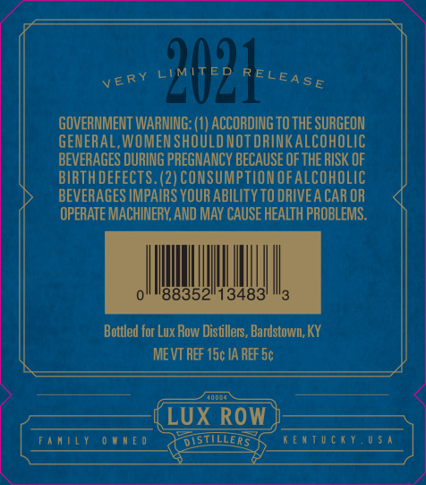
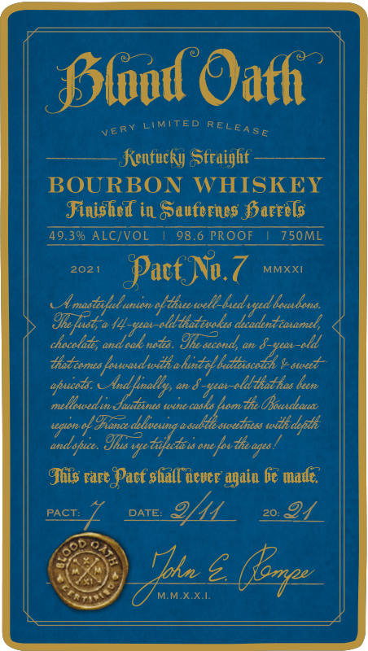
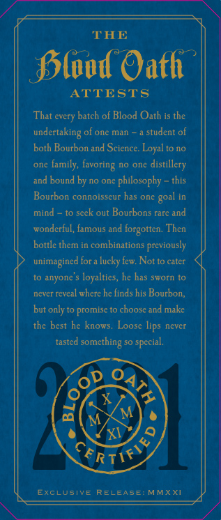

# TTB COLA Label Images - TTBID 20164001000238

**Brand Name:** BLOOD OATH

**Fanciful Name:** PACT NO. 7

**Issue Date:** 06/22/2020

**Origin Code:** 29

**Product Class/Type:** 641

**Source:** [TTB Public COLA Registry](https://ttbonline.gov/colasonline/viewColaDetails.do?action=publicFormDisplay&ttbid=20164001000238)

## Label Images

### Back Label

### Front Label

### Label 3

### Label 4

### Label 5

## Extracted Label Text

*Text extracted via OCR - may contain errors*

*1 image(s) excluded: text did not meet readability threshold*

**Detected Proof:** 98.6

### Back Label

202
GOVERNMENT WARNING: (1) ACCORDING To thE SURGEON
GENERAL,WOMEN SHOULD NOT DRINKalcoholIC
BEVERAGES DURING PREGNANCY BECAUSE OF THE RISK OF
BIRTH DEFECTS. (2) CONSUMPTLONOfalcoholic
BEVERAGES IMPAIRS YOUR ABILITY TO DRIVEA CAR OR
OPERATE MACHINERY
MAY CAUSE HEALTH PROBLEMS .
88352"13483
Bottled for Lux Row Distillers, Bardstown; KY
ME VT REF 15c IA REF Sc
LUX ROW
fanily
W n [ 0
DistilLeRS
I[nTUcKy,U $ ^
RELEASE
VERY
AND [

### Front Label

Sslod Oafh
LIMITED
Kenfuckyj Sfraighf
BOURBON
WHISKEY
Jinished in Sauferies Sarrels
49.396 ALCIVOL
98.6 PROOF
750ML
2021
Pact Na.7
MMXXI
UAmostttunungttheewelh-hedopd boodond
Ine [uot;@ 44
'zpat-eld -tatevgks dcadentcaxamel
chocolad, and cak nads . Ine secondy
8-seas-ald
tatcamnes fouvadwih ehuntol keettscodch & stecd-
And ynally,
ah
8-ax-eld-tathas been
mellouedun Jeuitunes tunecesks homtfe OBouudbouea
uqlt .
4 Ihance dehwenng e subde stectress toddh defdh
andsfuce . Ilus
; ane fos dieagea :
Ihis rart Pacf shall @evce again 6€ made"
PACT:
2HL
Tbk
MMXXI
RELEASE
VERy
apucato ,
"e trifecla u 2
DATE:
{op

### Label 3

THE
SSlood Oath
ATTESTS
That every batch of Blood Oath is the
of one man
student of
both Bourbon and Science: Loyal t0 no
onC
family;
no Onc
distillery
and bound by no one
philosophy
this
Bourbon connoisseur has one
mind
seek out Bourbons rare and
wonderful, famous and forgotten: Then
bottle them in combinations previously
unimagined fora lucky few Not to cater
anyone
loyalties, he has sworn to
never revcal wherc hc finds his Bourbon,
but only to promise to choose and make
the best he knows
Loose lips never
tasted
something =
special.
1
5
M
M
XI
Rti >
EXcLusivE
RELEASE:MMXXI
undertaking -
favoring
goal

### Label 5

VERY
LIMITED RELEASE
NEVER TO BE MADE AGAIN
{Rtifte
