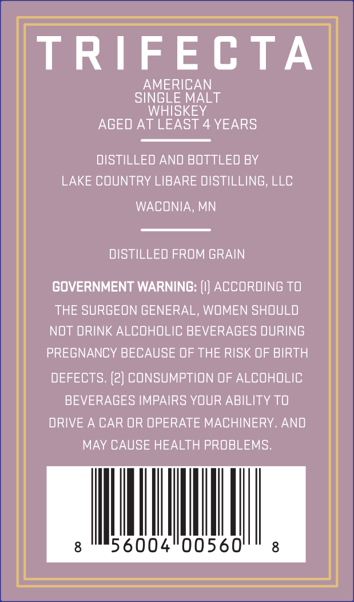
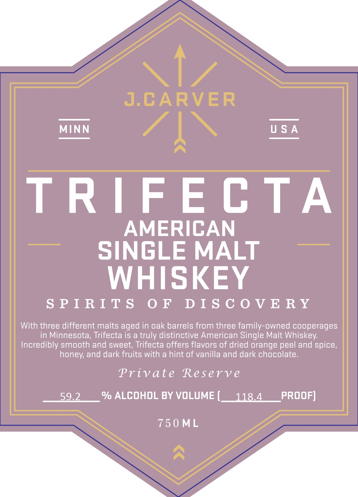

# TTB COLA Label Images - TTBID 20195001000459

**Brand Name:** J. CARVER

**Fanciful Name:** TRIFECTA AMERICAN SINGLE MALT WHISKEY

**Issue Date:** 07/27/2020

**Origin Code:** 27

**Product Class/Type:** 140

**Source:** [TTB Public COLA Registry](https://ttbonline.gov/colasonline/viewColaDetails.do?action=publicFormDisplay&ttbid=20195001000459)

## Label Images

### Back Label

### Front Label

## Extracted Label Text

*Text extracted via OCR - may contain errors*

**Detected Proof:** 118.4
**Detected Age:** 4 Years

### Back Label

TRIFECTA
AMERICAN
SINGLE MALT
WHISKEY
AGED AT LEAST 4 YEARS
DISTILLED AND BOTTLED BY
LAKE COUNTRY LIBARE DISTILLING, LLC
WACONIA
MN
DISTILLED FROM GRAIN
GOVERNMENT WARNING:
ACCORDING To
THE SURGEON GENERAL, WOMEN SHOULD
NOT DRINK ALCOHOLIC BEVERAGES DURING
PREGNANCY BECAUSE OF THE RISK OF BIRTH
DEFECTS: (2) CONSUMPTION OF ALCOHOLIC
BEVERAGES IMPAIRS YOUR ABILITY TO
DRIVE A CAR OR OPERATE MACHINERY. AND
MAY CAUSE HEALTH PROBLEMS;
56004
00560'
8

### Front Label

1
J.CARVER
MINN
U $ A
TRIFE C TA
AMERICAN
SINGLE MALT
WHISKEY
S P I RI T $
0 F
D I $ C 0 V E R Y
With three different malts aged in oak barrels from three family-owned cooperages
in Minnesota, Trifecta is a truly distinctive American Single Malt Whiskey:
Incredibly smooth and sweet; Trifecta offers flavors of dried orange peel and spice,
honey; and dark fruits with a hint of vanilla and dark chocolate_
Private
Reserv e
59.2
% ALCOHOL BY VOLUME (_ 118.4
prOOF)
750 ML
