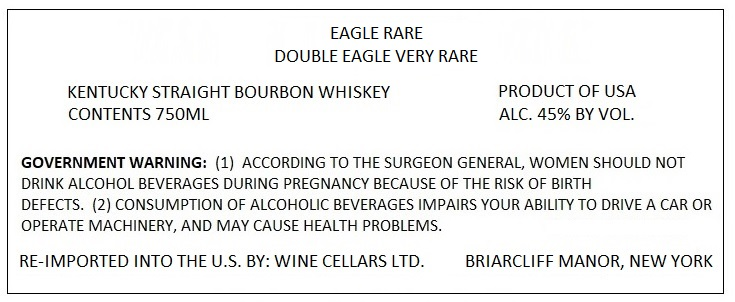
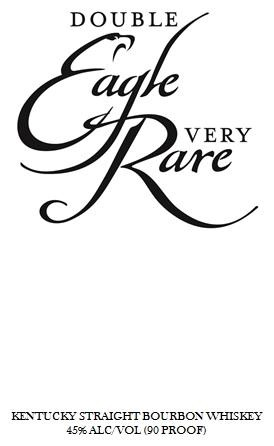
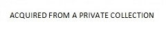

# TTB COLA Label Images - TTBID 20231001000482

**Brand Name:** EAGLE RARE

**Issue Date:** 08/25/2020

**Origin Code:** 22

**Product Class/Type:** 192

**Source:** [TTB Public COLA Registry](https://ttbonline.gov/colasonline/viewColaDetails.do?action=publicFormDisplay&ttbid=20231001000482)

## Label Images

### Back Label

### Label 2

### Label 3

## Extracted Label Text

*Text extracted via OCR - may contain errors*

*1 image(s) excluded: text did not meet readability threshold*

**Detected Proof:** 100

### Back Label

EAGLE RARE
DOUBLE EAGLE VERY RARE
KENTUCKY STRAIGHT BOURBON WHISKEY
PRODUCT OF USA
CONTENTS 7S0ML
ALC. 45% BY VOL.
GOVERNMENT WARNING: (1) ACCORDING TO THE SURGEON GENERAL, WOMEN SHOULD NOT
DRINK ALCOHOL BEVERAGES DURING PREGNANCY BECAUSE OF THE RISK OF BIRTH
DEFECTS. (2) CONSUMPTION OF ALCOHOLIC BEVERAGES IMPAIRS YOUR ABILITY TO DRIVE A CAR OR
OPERATE MACHINERY, AND MAY CAUSE HEALTH PROBLEMS
RE-IMPORTED INTO THE U.S. BY: WINE CELLARS LTD_
BRIARCLIFF MANOR, NEW YORK

### Label 2

DOUBLE
VERY
cre
KENTTUCKY STR-CHT BOL RBON WHISKEY
S0ALC VOL (50 PROOF}
agk
