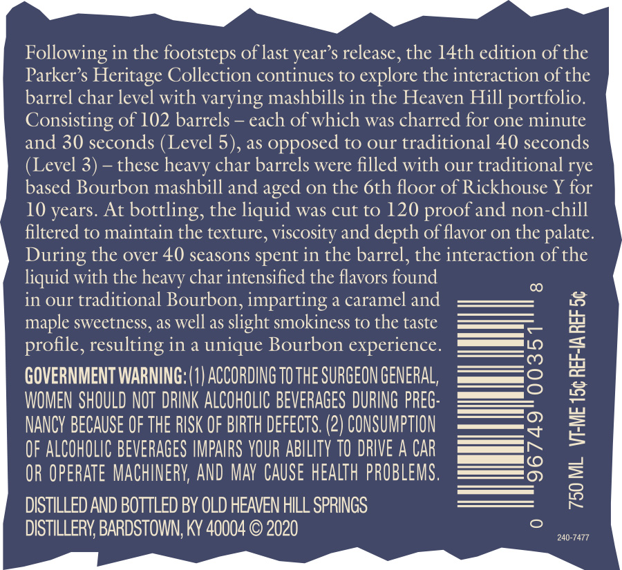
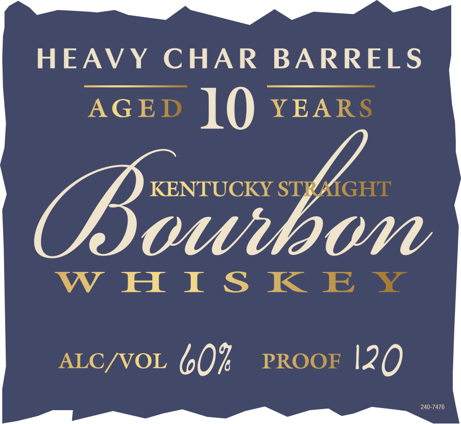
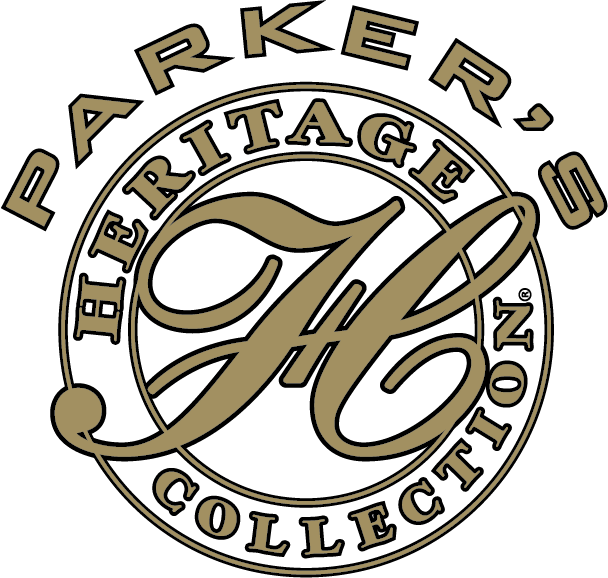

# TTB COLA Label Images - TTBID 20238001000192

**Brand Name:** PARKER'S HERITAGE COLLECTION

**Issue Date:** 08/28/2020

**Origin Code:** 22

**Product Class/Type:** 101

**Source:** [TTB Public COLA Registry](https://ttbonline.gov/colasonline/viewColaDetails.do?action=publicFormDisplay&ttbid=20238001000192)

## Label Images

### Back Label

### Front Label

### Label 2

## Extracted Label Text

*Text extracted via OCR - may contain errors*

*1 image(s) excluded: text did not meet readability threshold*

**Detected Proof:** 120
**Detected Age:** 10 Years

### Back Label

Following in the footsteps of last year’s release, the 14th edition of the

Parker’s Heritage Collection continues to explore the interaction of the

barrel char level with varying mashbills in the Heaven Hill portfolio.

Consisting of 102 barrels — each of which was charred for one minute

and 30 seconds (Level 5), as opposed to our traditional 40 seconds

(Level 3) — these heavy char barrels were filled with our traditional rye

based Bourbon mashbill and aged on the 6th floor of Rickhouse Y for

10 years. At bottling, the liquid was cut to 120 proof and non-chill

filtered to maintain the texture, viscosity and depth of flavor on the palate

During the over 40 seasons spent in the barrel, the interaction of the

liquid with the heavy char intensified the flavors found

in our traditional Bourbon, imparting a caramel and

maple sweetness, as well as slight smokiness to the taste

profile, resulting in a unique Bourbon experience

IN")

————o

GOVERNMENT WARNING: (1) ACCORDING 10 THE SURGEON GENERAL,

— ©

WOMEN SHOULD NOT DRINK ALCOHOLIC BEVERAGES DURING PREG

NANCY BECAUSE OF THE RISK OF BIRTH DEFECTS. (2) CONSUMPTION

OF ALCOHOLIC BEVERAGES IMPAIRS YOUR ABILITY TO DRIVE A CAR

——

|__ ide}

OR OPERATE MACHINERY, AND MAY CAUSE HEALTH PROBLEMS.

DISTILLED AND BOTTLED BY OLD HEAVEN HILL SPRINGS

DISTILLERY, BARDSTOWN, KY 40004 © 2020

240-7477

_ PP i.e >rFreE- —

### Front Label

HEAVY CHAR BARRELS
AGED 10 YEARS

KENTUCKY STRAIGHT

COV

WHISKEY

ALC/VOL 60% prRoor 120
