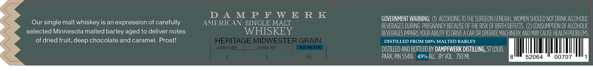

# TTB COLA Label Images - TTBID 20239001000638

**Brand Name:** DAMPFWERK DISTILLING

**Fanciful Name:** AMERICAN SINGLE MALT

**Issue Date:** 09/19/2020

**Origin Code:** 27

**Product Class/Type:** 149

**Source:** [TTB Public COLA Registry](https://ttbonline.gov/colasonline/viewColaDetails.do?action=publicFormDisplay&ttbid=20239001000638)

## Label Images

### Label 1

## Extracted Label Text

*Text extracted via OCR - may contain errors*

**Detected Proof:** 86

### Label 1

D A M P F W E R K
GOVERNMENT WARNING:
AcCORDInG TO THE SURGEON GENERA L, WOMEN SHOULD NOT driNK ALcoHOlic
Our single malt whiskey is an expression of carefully
AMERICAN
SINGLE MALT
BEVERAGES DURING PREGNANCY BECAUSE OF THE RISK OF BIRTH DEFECTS
CONSUMPTION OF ALCOHoLIc
selected Minnesota malted barley aged to deliver notes
WHISKEY
BEVERAGES IMPAIRS YOUR ABILITY TO DRIVEA CAR OR OPERATE MACHINERV AND may CAUSE HEALTH PROBLEMS
of dried fruit, deep chocolate and caramel. Prostl
HERITAGE MIDWESTER GRAIN
DISTILLED FROM 100% MALTED BARLEY
edition No
bottle No
ALC BYVOL
DISTILLED AND BOTTLED BY DAMPFWERK DISTILLING, ST LOUIS
43
PARK MN 55416
43% ALC . BY VOL . 750 ML
52064
00707
