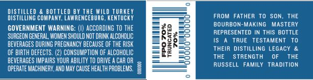
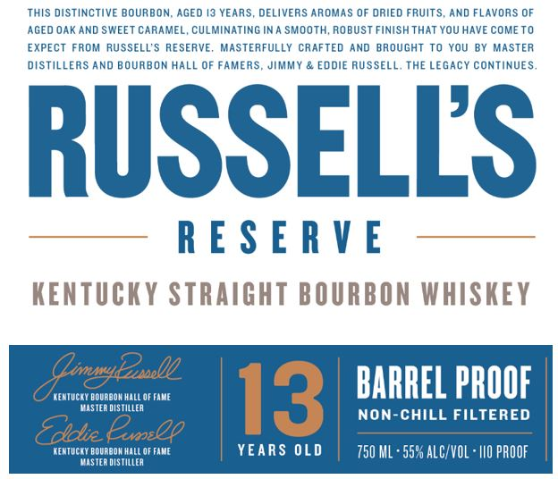
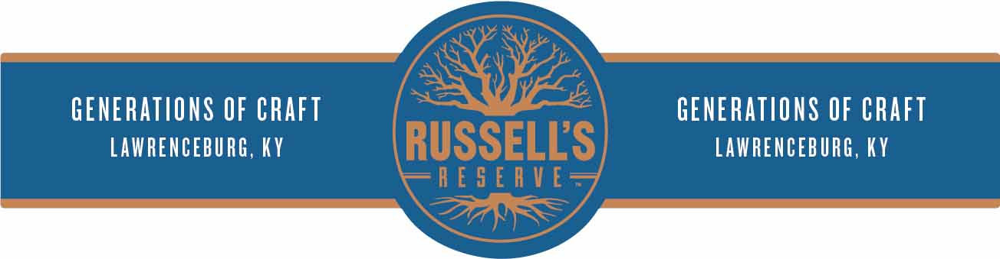

# TTB COLA Label Images - TTBID 20259001000333

**Brand Name:** RUSSELL'S RESERVE

**Fanciful Name:** 13 YEARS OLD

**Issue Date:** 09/18/2020

**Origin Code:** 22

**Product Class/Type:** 101

**Source:** [TTB Public COLA Registry](https://ttbonline.gov/colasonline/viewColaDetails.do?action=publicFormDisplay&ttbid=20259001000333)

## Label Images

### Back Label

### Label 1

### Label 3

## Extracted Label Text

*Text extracted via OCR - may contain errors*

*1 image(s) excluded: text did not meet readability threshold*

### Back Label

DISTILLED & BOTTLED BY THE WILD TURKEY

FROM FATHER TO SON, THE

DISTILLING COMPANY, LAWRENCEBURG, KENTUCKY

BOURBON-MAKING MASTERY

GOVERNMENT WARNING: (|) ACCORDING TO THE

89

REPRESENTED IN THIS BOTTLE

‘SURGEON GENERAL, WOMEN SHOULD NOT DRINK ALCOHOLIC

ae

BEVERAGES DURING PREGNANCY BECAUSE OF THE RISK

RES

IS A TRUE TESTAMENT TO

(OF BIRTH DEFECTS. (2) CONSUMPTION OF ALCOHOLIC.

THEIR DISTILLING LEGACY &

BEVERAGES IMPAIRS YOUR ABILITY TO DRIVE ACAROR

THE

STRENGTH

OF

THE

RUSSELL FAMILY TRADITION

‘OPERATE MACHINERY, AND MAY CAUSE HEALTH PROBLEMS, =

### Label 1

THIS DISTINCTIVE BOURBON, AGED 19 YEARS, DELIVERS AROMAS OF ORIED FRUITS, AND FLAVORS OF
AGED OAK AND SWEET CARAMEL, CULMINATING INA SMOOTH, ROBUST FINISH THAT YOU HAVE COME TO
EXPECT FROM RUSSELL’S RESERVE. MASTERFULLY CRAFTED AND BROUGHT TO YOU BY MASTER
DISTILLERS AND BOURBON HALL OF FAMERS, JIMMY & EDDIE RUSSELL. THE LEGACY CONTINUES.
KENTUCKY STRAIGHT BOURBON WHISKEY
Aigats BARREL PROOF
‘enter oregon oe
Te aN NON-CHILL FILTERED
“lle Cen
HENTUCKY BOURBON HALL OF FAME YEARS OLD 750 ML > 55% ALC/VOL - 110 PROOF
son STLR
