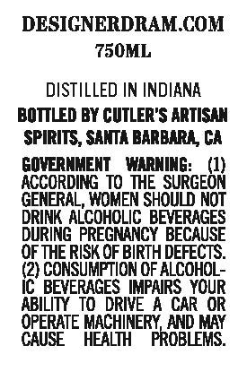
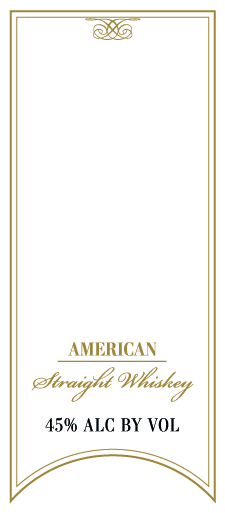

# TTB COLA Label Images - TTBID 20314001000679

**Brand Name:** DESIGNER DRAM

**Issue Date:** 11/16/2020

**Origin Code:** 01

**Product Class/Type:** 109

**Source:** [TTB Public COLA Registry](https://ttbonline.gov/colasonline/viewColaDetails.do?action=publicFormDisplay&ttbid=20314001000679)

## Label Images

### Back Label

### Front Label

### Label 2

## Extracted Label Text

*Text extracted via OCR - may contain errors*

**Detected Proof:** 90

### Back Label

DESIGNERDRAM.COM
750ML
DISTILLED IN INDIANA
BOTTLED BY CUTLER'S ARTISNY
SPIRITs , SANTTA BARBARL  CA
GOMERNMENT
KIRNING:
(1)
ACCORDING To THE SURGEON
GENERAL, WOMEN SHOULD MOT
DRINK ALCOHOLIC BELERAGES
DURING  PREGNANCY  BECAUSE
OF THE RISKOF BIRTH DEFECTS:
(2) CONSUMPTION OF ALCOHOL-
IC BEVERAGES IMPAIRS YOUR
ABILITY  ToDRIVE
A CAR OR
OPERATE MACHINERY_AND MAY
CAUSE
HEALT
FROBLEMS:

### Front Label

AMERICAN
eftraigk
45% ALC BY VOL
OWliakey

### Label 2

NER
eee SOT
{ORD F) SLU IAG [WO OU) ey PARE D5 Sa,
Crome amc =e jz nastics
SSS 9
