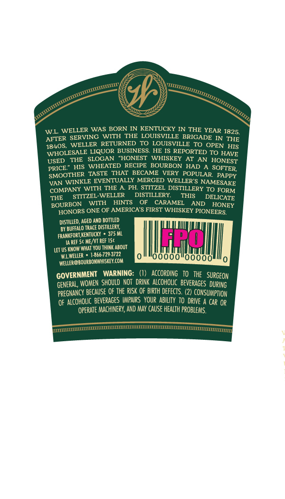

# TTB COLA Label Images - TTBID 20321001000497

**Brand Name:** WELLER

**Issue Date:** 11/17/2020

**Origin Code:** 22

**Product Class/Type:** 101

**Source:** [TTB Public COLA Registry](https://ttbonline.gov/colasonline/viewColaDetails.do?action=publicFormDisplay&ttbid=20321001000497)

## Label Images

### Back Label

### Front Label

## Extracted Label Text

*Text extracted via OCR - may contain errors*

### Back Label

é

G

S))

ss

sat

av)

Meer

as

}

ti

ss

\,

am

ee

Z

s

Rey

wl

ELLER WAS BORN IN KENTUCKY IN THE YEAR 1925,

AFTER SERVING WITH THE LOU!

ILLE BRIGADE IN THE

48408, WELLER RETURNED TO LOUISVILLE TO OPEN Hig

WHOLESALE LIQUOR BUSINESS. HE 18 REPORTED TO HAVE

THE SLOGAN

HONEST WHISKEY AT AN HON,

us

ED

EST

PRICE.” HIS

WHEATED RECIPE BOURBON HAD A SOFTER

‘SMOOTH

TASTE THAT BECAME VERY POPULAR PAppy

VAN WINKLE EVENTUALLY MERGED WELLER’S NAM

KE

COMPANY WITH THE A. PH. STITZEL DISTILLERY TO FORM

THE

STITZEL-WELLER

DISTILLE!

oe

THIS

DELICATE

BOURBON WITH

HINTS

OF CARAMEL

AND.

HONE

;

HONORS ONE OF AMERICA’S FIRST

HISKEY PIONEERS,

DISTILLED, AGED AND BOTTLED

BY BUFFALO TRACE DISTILLERY,

FRANKFORT KENTUCKY » 375 ML

AREF 5¢ ME

FSC

{ET US KNOW WHAT YOU THINK ABOUT

WALIWELLER » 1-866-7293722

|

o!looooo!oocdo!lly

\WELLER@BOURBONWHISKEY.COM

‘i

A

GOVERNMENT WARNING: (

ORDING TO THE SURGEON

GENERAL, WOMEN SHOULD NOT DRINK ALCOHOLIC BEVERAGES DURING

7

PREGNANCY BECAUSE OF THE RISK OF BIRTH DEFECTS. (2) CONSUMM

Pi

TION

OF ALCOHOLIC BEVERAGES IMPAIRS YOUR ABILITY TO DRIVE A c

OPERATE MV

HINERY, AND MA

Cal

E HEALTH PROBLEMS,

or

ran

sm

mn

om

mer

irs

7

### Front Label

Z

NY

y)

sss

ae 2

y

ss

se

Ry,

ss

ew,

SS

Welle

‘HE

RIGINAL

WH

ATED BOURBON

SPECIAL RESERVE

KENTUC

TRAIGHT BOU

2BON

IN

ISKE!

190

01

ferrets

AEE
