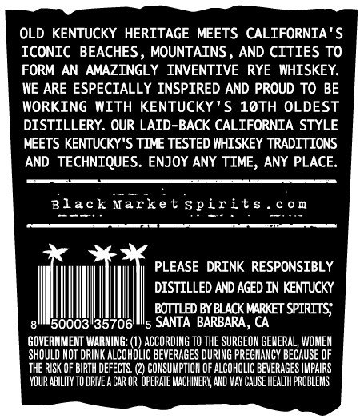
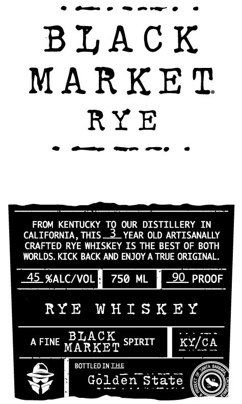

# TTB COLA Label Images - TTBID 20335001000618

**Brand Name:** BLACK MARKET

**Issue Date:** 12/02/2020

**Origin Code:** 01

**Product Class/Type:** 142

**Source:** [TTB Public COLA Registry](https://ttbonline.gov/colasonline/viewColaDetails.do?action=publicFormDisplay&ttbid=20335001000618)

## Label Images

### Back Label

### Label 1

## Extracted Label Text

*Text extracted via OCR - may contain errors*

### Back Label

OLD KENTUCKY HERITAGE MEETS CALIFORNIA'S

ICONIC BEACHES, MOUNTAINS, AND CITIES TO

FORM AN AMAZINGLY INVENTIVE RYE WHISKEY.

WE ARE ESPECIALLY INSPIRED AND PROUD TO BE

WORKING WITH KENTUCKY'S 10TH OLDEST

DISTILLERY. OUR LAID-BACK CALIFORNIA STYLE

MEETS KENTUCKY'S TIME TESTED WHISKEY TRADITIONS

AND TECHNIQUES. ENJOY ANY TIME, ANY PLACE.

Black Market spirits

com

PLEASE DRINK RESPONSIBLY

DISTILLED AND AGED IN KENTUCKY

|

BOTTLED BY BLACK MARKET SPIRITS;

8''50003"35706'

'5 SANTA BARBARA, CA

GOVERNMENT WARNING: (1) ACCORDING TO THE SURGEON GENERAL, WOMEN

‘SHOULD NOT DRINK ALCOHOLIC BEVERAGES DURING PREGNANCY BECAUSE OF

‘THE RISK OF BIRTH DEFECTS. (2) CONSUMPTION OF ALCOHOLIC BEVERAGES IMPAIRS

‘YOUR ABILITY TO DRIVE ACAR OR OPERATE MACHINERY, AND MAY CAUSE HEALTH PROBLEMS,

### Label 1

«ome maw

.

BLACK

MARKET

RYE

oe oe we owe

.

iti

FROM KENTUCKY TQ OUR DISTILLERY IN

CALIFORNIA, THIS —3_ YEAR OLD ARTISANALLY

CRAFTED RYE WHISKEY IS THE BEST OF BOTH

WORLDS. KICK BACK AND ENJOY A TRUE ORIGINAL.

ALC/VK

PROOF

RYE WHISKEY

KY,

——

AFINE PARR SPIRIT

BOTTLED INIHE

Golden $
