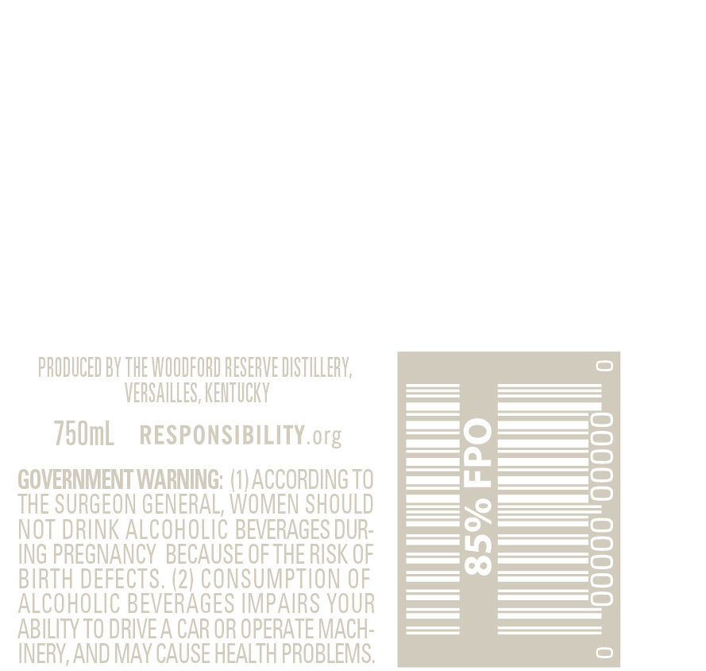
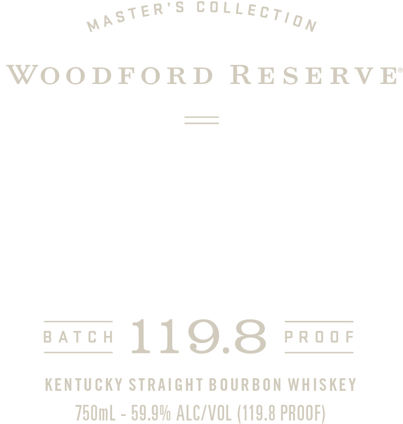

# TTB COLA Label Images - TTBID 20343001000184

**Brand Name:** WOODFORD RESERVE

**Fanciful Name:** MASTER'S COLLECTION BATCH PROOF

**Issue Date:** 12/08/2020

**Origin Code:** 22

**Product Class/Type:** 101

**Source:** [TTB Public COLA Registry](https://ttbonline.gov/colasonline/viewColaDetails.do?action=publicFormDisplay&ttbid=20343001000184)

## Label Images

### Back Label

### Front Label

### Label 3

## Extracted Label Text

*Text extracted via OCR - may contain errors*

*1 image(s) excluded: text did not meet readability threshold*

**Detected Proof:** 119.8

### Back Label

PRODUCED BY THE WOODFORD RESERVE DISTILLERV;
VERSAILLES, KENTUCKV
750mL
RESPONSIBILITY org
GOVERNMENT WARNING; (0| ACCORDING TO
3
THE SURGEON GENERAL; WOMEN SHOULD
0
NOT DRINK ALCOHOLIC BEVERAGES DUR"
ING PREGNANCY BECAUSE OFTHE RISK OF
8
BIRTH DEFECTS. (2) CONSUMPTION OF
ALCOHOLIC BEVERAGES IMPAIRS VOUR
ABILITY TO DRIVEA CAR OR OPERATE MACH"
INERV, AND MAv CAUSE HEALTH PROBLEMS:

### Front Label

eee ECT ia,
WOODFORD RESERVE
BATCH 119.8 PROOF
KENTUCKY STRAIGHT BOURBON WHISKEY
750mL - 59.9% ALC/VOL (119.8 PROOF)
