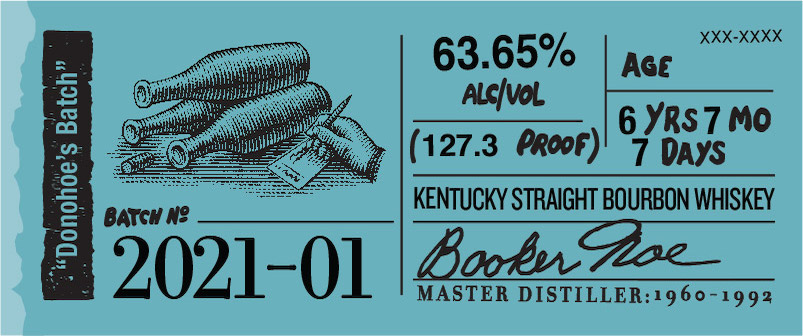

# TTB COLA Label Images - TTBID 20356001000153

**Brand Name:** BOOKER'S

**Issue Date:** 12/28/2020

**Origin Code:** 22

**Product Class/Type:** 101

**Source:** [TTB Public COLA Registry](https://ttbonline.gov/colasonline/viewColaDetails.do?action=publicFormDisplay&ttbid=20356001000153)

## Label Images

### Back Label

### Label 1

### Label 2

### Label 4

## Extracted Label Text

*Text extracted via OCR - may contain errors*

*1 image(s) excluded: text did not meet readability threshold*

**Detected Proof:** 127.3
**Detected Age:** 6 Years

### Back Label

BOOKER'Se KENTUCKY STRAIGHT BOURBON WHISKEY
DISTILLED AND BOTTLED BY JAMES B. BEAM DISTILLING CO.
CLERMONT, KENTUCKY
GOVERNMENT WARNING: (1| ACCORDING TO
THE  SURGEON  GENERAL, WOMEN   ShOULI
NOT DRINKalCOhOLIC bEVERAgeS DURIUG
pReGhANCY
BECAUSE
OF
THE
RISK
OF BIRTh  DEFECTS. (2) CONSUMPTHON OF
alCohOlIg   bEvERageS   IMpAIrS   YOUR
abilITy TO DRIVE A CAR OR OPERATE MAChIN:
ERY,ANd   May  CAUSE   HEALTh  PROBLEMS.
0
80686"01140'
8
ME VT REF 154=
IA REF S4
124-2455-A

### Label 1

BBokeh
@e
w Hlo packaqe /
Tdlahut oradekuNeor-cxeabz
1
"@a tonzeandro
1
my I-dathfmm Zoam /sys hto
whukeyfrom duiz %o eigrt _
022,
Z5OML
Eoker?? Sburbon24
"falztuitren
%
remabl
snly pieces
bssL
124-1420-A
IRibt -
LrpaLlxce'
~Eea _

### Label 2

XXX-XXXX
63.65%
Age
3
Alcivol
6 YRS 7 Mo
(127.3 Propf)
DAYS
j
BATCH N?
KENTUCKY STRAIGHT BOURBON WHISKEY
2021-01
BooEu7ece
MASTER DISTILLER:1960-1992
