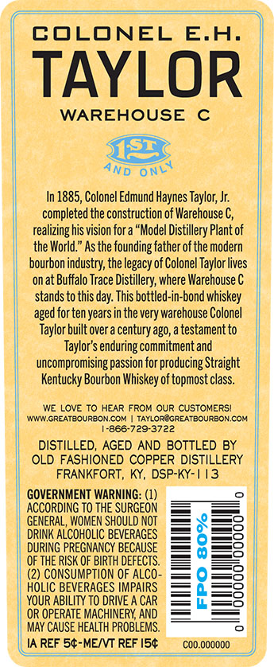
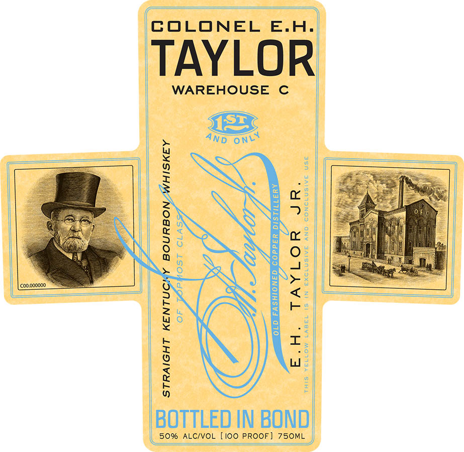

# TTB COLA Label Images - TTBID 21006001000336

**Brand Name:** COLONEL E.H. TAYLOR

**Issue Date:** 01/07/2021

**Origin Code:** 22

**Product Class/Type:** 111

**Source:** [TTB Public COLA Registry](https://ttbonline.gov/colasonline/viewColaDetails.do?action=publicFormDisplay&ttbid=21006001000336)

## Label Images

### Back Label

### Label 1

### Label 3

## Extracted Label Text

*Text extracted via OCR - may contain errors*

*1 image(s) excluded: text did not meet readability threshold*

### Back Label

lam

—

—

ee

=)

)

|

COLONEL E.H.

TAYLOR:

WAREHOUSE C

i

4

4N5 ony

In 1885, Colonel Edmund Haynes Taylor, Jr.

completed the construction of Warehouse C,

realizing his vision fora “Model Distillery Plant of

|

i}

the World.” As the founding father of the modern

|

bourbon industry, the legacy of Colonel Taylor lives

onat Buffalo Trace Distillery, where Warehouse C

stands to this day. This bottled-in-bond whiskey

aged for ten years in the very warehouse Colonel

I

Taylor built over'a century ago, a testament to

|

Taylor's enduring commitment and

‘uncompromising passion for producing Straight

Kentucky Bourbon Whiskey of topmost class.

| www GREATEOURBON.COM | TAYLOREGREATBOURBON.COM

WE LOVE TO HEAR FROM OUR CUSTOMERS!

1-866-729-3722

I

DISTILLED, AGED AND BOTTLED BY

|

ILD FASHIONED COPPER DISTILLERY

FRANKFORT, KY, DSP-KY-1 13

GOVERNMENT WARNING: (1)

°

ACCORDING TO THE SURGEON

| GENERAL, WOMEN SHOULD NOT

=o

DRINK ALCOHOLIC BEVERAGES

| DURING PREGNANCY BECAUSE

=o

OF THE RISK OF BIRTH DEFECTS.

na) CONSUMPTION OF ALCO-

| HOLIC BEVERAGES IMPAIRS

=o

=s

YOUR ABILITY TO DRIVE A CAR

OR OPERATE MACHINERY, AND

| MAY CAUSE HEALTH PROBLEMS.

© |

ll JA REF 5¢-ME/VT REF I5¢

Bee FAS

c00.000000

### Label 3

ESOS ERIN UAC
MOMENT GOUTUOUuO

‘©00,000000
