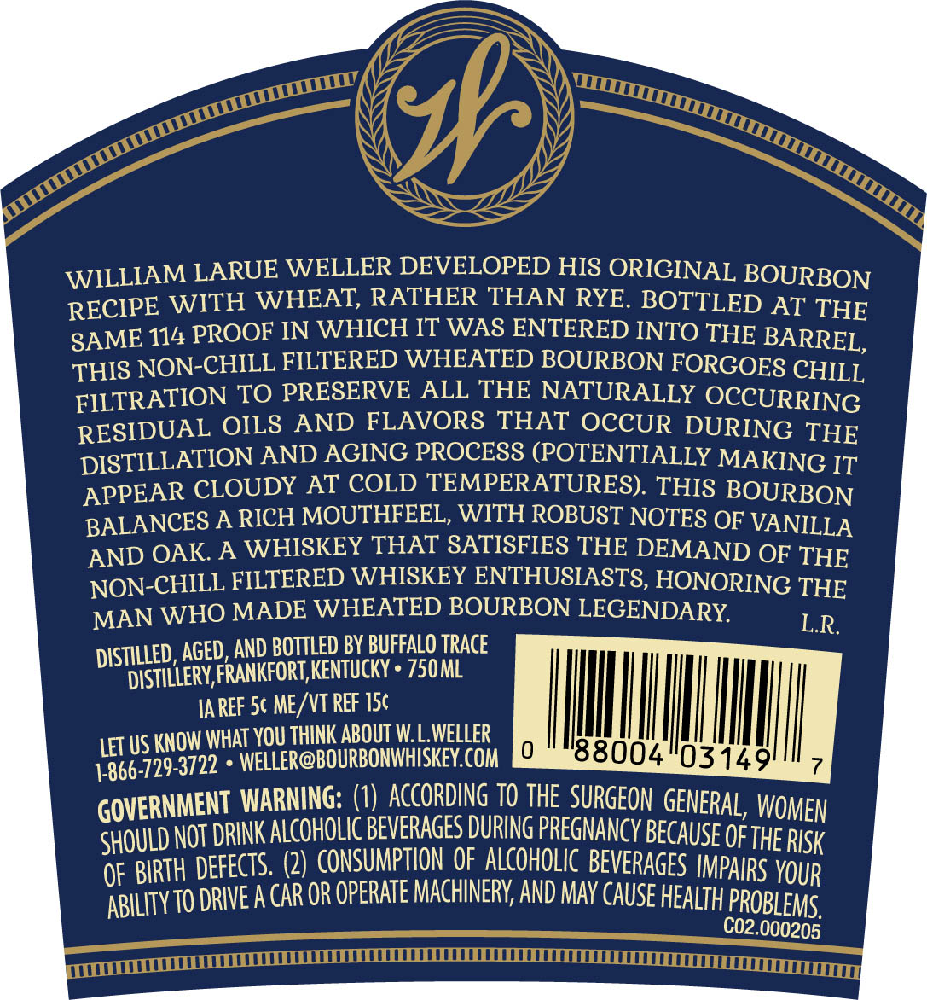
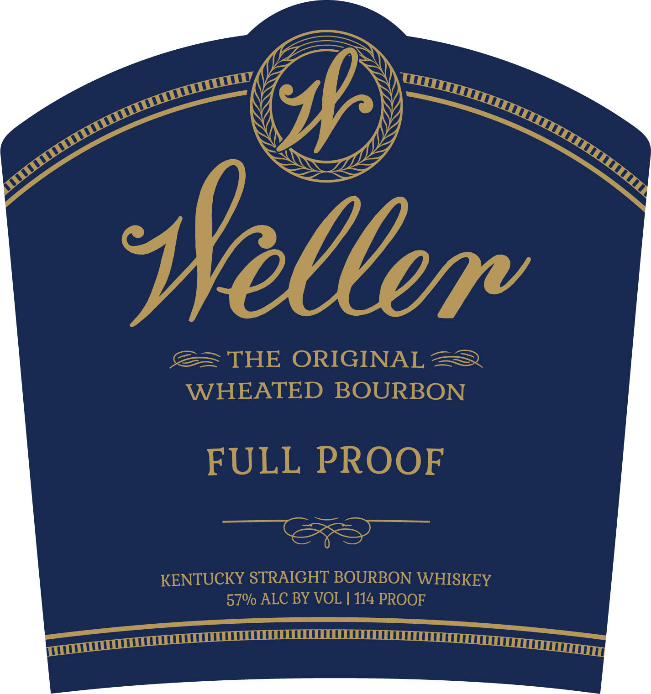

# TTB COLA Label Images - TTBID 21006001000358

**Brand Name:** WELLER

**Issue Date:** 01/08/2021

**Origin Code:** 22

**Product Class/Type:** 101

**Source:** [TTB Public COLA Registry](https://ttbonline.gov/colasonline/viewColaDetails.do?action=publicFormDisplay&ttbid=21006001000358)

## Label Images

### Back Label

### Label 1

## Extracted Label Text

*Text extracted via OCR - may contain errors*

### Back Label

WILLIAM LARUE WELLER DEVELOPED HIS ORIGINAL BOURBON

RECIPE WITH WHEAT, RATHER THAN RYE. BOTTLED AT THE

SAME 114 PROOF IN WHICH IT WAS ENTERED INTO THE BARREL,

THIS NON-CHILL FILTERED WHEATED BOURBON FORGOES CHILL

FILTRATION TO PRESERVE ALL THE NATURALLY OCCURRING

RESIDUAL OILS AND FLAVORS THAT OCCUR DURING THE

DISTILLATION AND AGING PROCESS (POTENTIALLY MAKING IT

APPEAR CLOUDY AT COLD TEMPERATURES). THIS BOURBON

BALANCES A RICH MOUTHFEEL, WITH ROBUST NOTES OF VANILLA

AND OAK. A WHISKEY THAT SATISFIES THE DEMAND OF THE

NON-CHILL FILTERED WHISKEY ENTHUSIASTS, HONORING THE

MAN WHO MADE WHEATED BOURBON LEGENDARY.

LR.

DISTILL

DIST

ED, AGED, AND BOTTLED BY BUFFALO TRACE

TLLERY, FRANKFORT, KENTUCKY * 750 ML

IAREF 5¢ ME/VT REF 15¢

|

||

|

|

|

LET US KNO

W WHAT YOU THINK ABOUT W. L.WELLER

77). « WELLER@BOURBONWHISKEY.COM

0)

|

8800

4

0314

9

il

1-866-729-3:

G

OVERNMENT WARNING: (1) ACCORDING 10 THE SURGEON GENER

‘AL, WOMEN

HOULD NOT DRINK ALCOHOLIC BEVERAGES DURING PREGNANCY BECAUS|

E OF THE RIS

OF BIRTH DE

FECTS. (2) CONSUMPTION OF ALCOHOLIC BEVERAGES IM

PAIRS YOUR

IVEACAR OR OPERATE MACHINERY, AND MAY CAUSE HEALT

ABILITY 10 DR

H PROBLEMS,

C02.000205

ee ey

### Label 1

ZEN

“ps

Y

gor

wo

(

sy

Sa SS

We

ay

sy

» ee

S= THE ORIGINAL 2S

WHEATED BOURBON

FULL PROOF

— SS

KENTUCKY STRAIGHT BOURBON WHISKEY

57% ALC BY VOL | 114 PROOF

wit

Fear rn nS TEOCELEET OEE OEE OE COeOOeE TE TTEE rey
