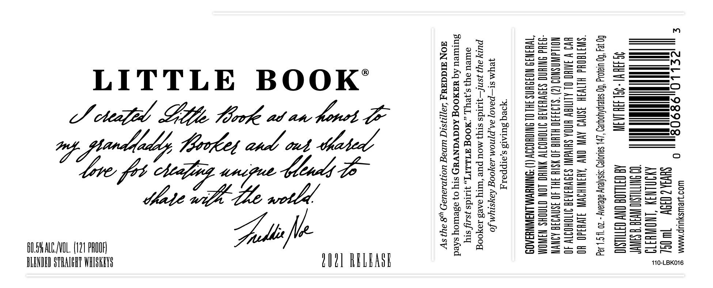

# TTB COLA Label Images - TTBID 21021001000086

**Brand Name:** LITTLE BOOK

**Issue Date:** 02/01/2021

**Origin Code:** 22

**Product Class/Type:** 120

**Source:** [TTB Public COLA Registry](https://ttbonline.gov/colasonline/viewColaDetails.do?action=publicFormDisplay&ttbid=21021001000086)

## Label Images

### Label 1

### Label 2

## Extracted Label Text

*Text extracted via OCR - may contain errors*

### Label 1

= —

eos

oo

Sot

Bo

S75

i

a

us

——

———=

i — i — en

——

LITTLE BOOK’

Sma a

Sole

-=

{__ We)

i

=u

we os

of = >

SE Sonwy

{Ne}

J cheap Dito, Mook at an fret (6.

——O

=a=

wooo Ses

e=xo

See t=

eoea

nos

ard ont Uebel

Sotauw

—.—-—

eG

== S=

n>

Bm Se>—

—_ a —

Yipee

thats

_— a)

=a =

—i—

SS

-—)

aesaSeq

date

Sous

I

——

——

>_<

=—_—._.—1—

SSot

oS =

—= =

a

— =

—— i

oc Soe

————

Spade le

=

7

BOLSHALCL/VOL. (121 PROOF)

— ——

SS=auc

S2a=— |

BLENDED STRAIGHT WHISKEYS

LN) RELEASE

110-LBK016

### Label 2

| a
