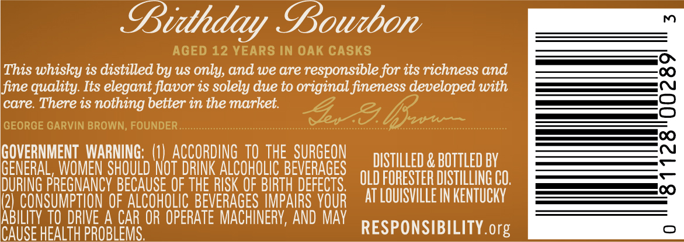
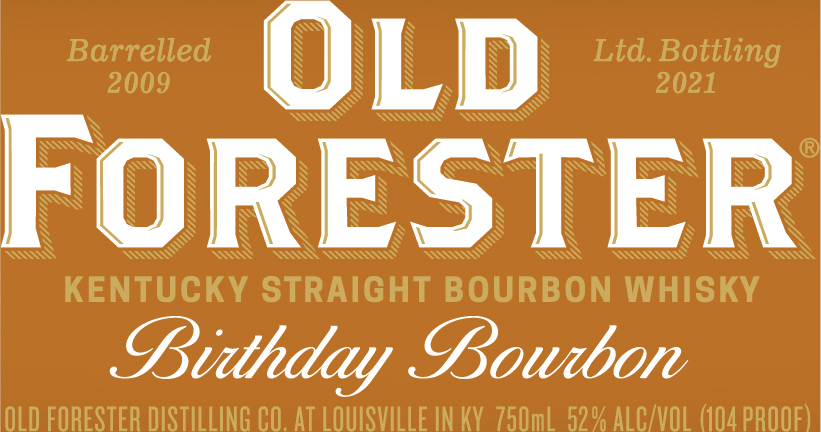
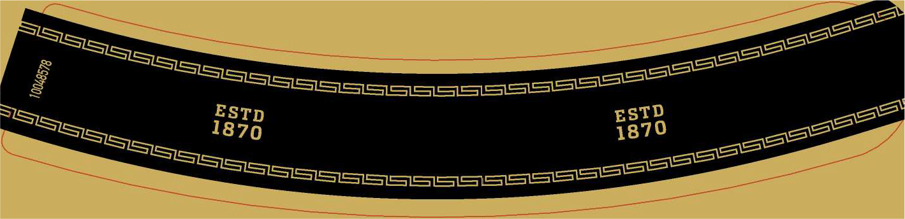
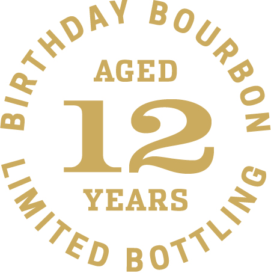
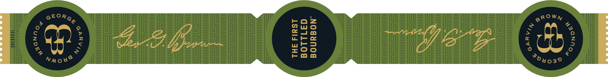

# TTB COLA Label Images - TTBID 21048001000076

**Brand Name:** OLD FORESTER

**Fanciful Name:** BIRTHDAY BOURBON 2021

**Issue Date:** 02/24/2021

**Origin Code:** 22

**Product Class/Type:** 101

**Source:** [TTB Public COLA Registry](https://ttbonline.gov/colasonline/viewColaDetails.do?action=publicFormDisplay&ttbid=21048001000076)

## Label Images

### Back Label

### Front Label

### Label 3

### Label 4

### Label 5

## Extracted Label Text

*Text extracted via OCR - may contain errors*

*3 image(s) excluded: text did not meet readability threshold*

**Detected Proof:** 104
**Detected Age:** 12 Years

### Back Label

Gidthday Gowtbon
m
AGED 12 YEARS IN OAK CASKS
This whisky is distilled by uS only, and we are responsible for its richness and
fine quality:
elegant flavor is solely due to original fineness developed with
8
care. There is nothing better in the market.
GEORGE GARVIN BROWN; FOUNDER_
GOVERNMENT WARNING;   (1|  ACCORDING TO ThE   SURGEON
DISTILLED & BOTTLED BY
GENERAL,WOMEN SHOULD NOT DRINK ALCOHOLIC BEVERAGES
DuRING PREGNANCY BECAUSE OF THE RISK QF BIRTH DEFECTS
OLD FORESTER DISTILLING CO,
CONSUMPTION OF ALCOHOLIC BEVERAGES IMPAIRS VOUR
AT LOUISVILLE IN KENTUCKY
RBEoVS_vdahDE OEAXCOHOPERREVERAGESERPAARSS YoAp
ICAUSE HEALTH PROBLEMS .
RESPONSIBILITY org
Its

### Front Label

Barrelled
OLD
Ltd Bottling
2009
2021
FORESTER
KENTUCKY STRAIGHT BOURBON WHISKY
Bidthday Bowdbon
OLD FORESTER DISTILLING CO .At LOuISVLLE IN KV750mL 52 % AlC/vol (104 pROOF)
