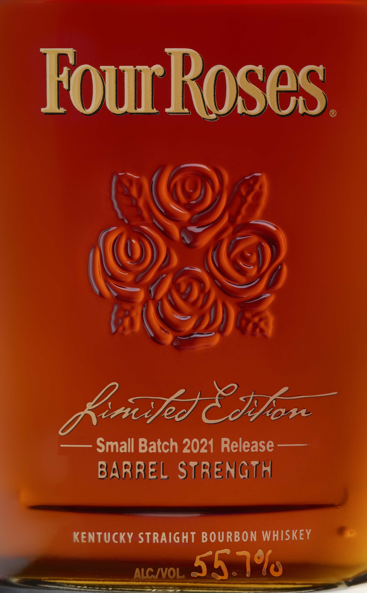
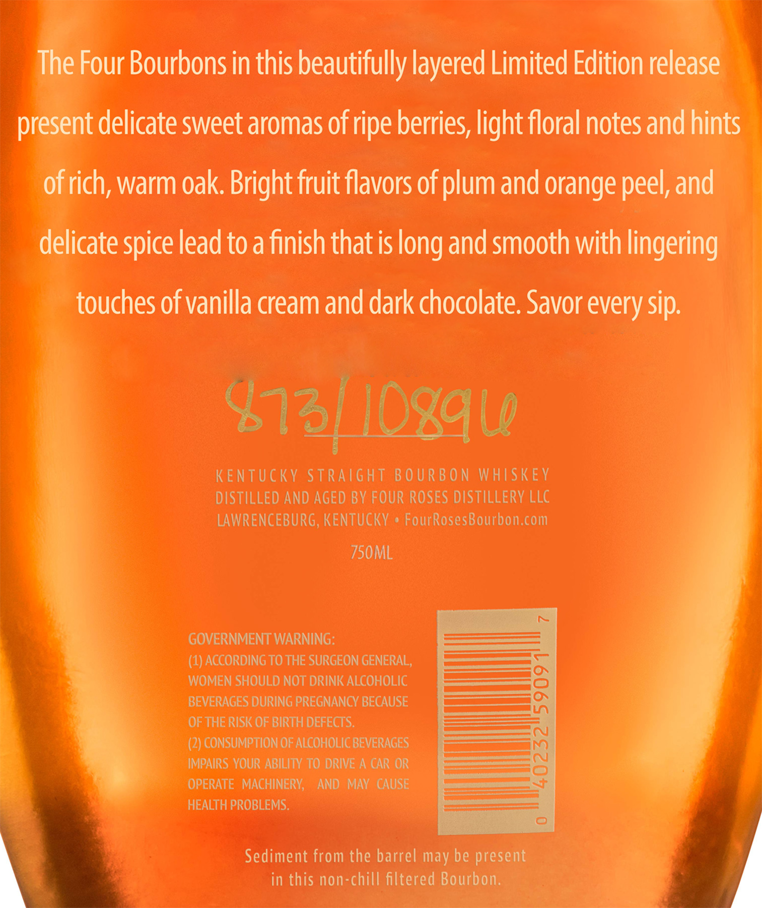
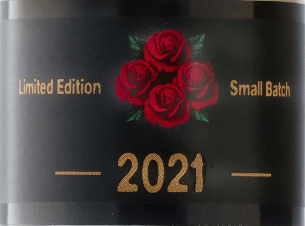

# TTB COLA Label Images - TTBID 21067001000899

**Brand Name:** FOUR ROSES

**Fanciful Name:** LIMITED EDITION SMALL BATCH

**Issue Date:** 03/15/2021

**Origin Code:** 22

**Product Class/Type:** 101

**Source:** [TTB Public COLA Registry](https://ttbonline.gov/colasonline/viewColaDetails.do?action=publicFormDisplay&ttbid=21067001000899)

## Label Images

### Label 1

### Label 2

### Label 3

## Extracted Label Text

*Text extracted via OCR - may contain errors*

*1 image(s) excluded: text did not meet readability threshold*

### Label 1

JU.

oh

Ko

K

Z

Op

(Z

DD)

i

raw

Lei Jed CN ion

— Small Batch 2021 Release ——

BARREL STRENGIA

KENTUCKY eae oe Alaa

### Label 2

Four Bourbons in this beautifully layered Limited Edition relee

esent delicate sweet aromas of ripe berries, light floral notes an

delicate spice lead to a finish that is long and smooth with lingering

~ touches of vanilla cream and dark chocolate. Savor every sip.

$1/ |O%av

KENTUCKY STRAIGHT BOURBON WHISKEY
DISTILLED AND AGED BY FOUR ROSES DISTILLERY LLC
LAWRENCEBURG, KENTUCKY » FourRosesBourbon.com

750ML

GOVERNMENT WARNING:

(4) ACCORDING TO THE SURGEON GENERAL,
WOMEN SHOULD NOT DRINK ALCOHOLIC

BEVERAGES DURING PREGNANCY BECAUSE

OF THE RISK OF BIRTH DEFECTS.

~____ (2) CONSUMPTION OF ALCOHOLIC BEVERAGES.
____ IMPAIRS YOUR ABILITY TO DRIVE A CAR OR
~ OPERATE MACHINERY, AND MAY CAUSE
HEALTH PROBLEMS.

Sediment from the barrel may be present
in this non-chill filtered Bourbon.
