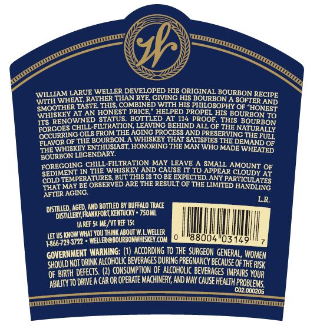

# TTB COLA Label Images - TTBID 21074001000315

**Brand Name:** WELLER

**Issue Date:** 03/17/2021

**Origin Code:** 22

**Product Class/Type:** 101

**Source:** [TTB Public COLA Registry](https://ttbonline.gov/colasonline/viewColaDetails.do?action=publicFormDisplay&ttbid=21074001000315)

## Label Images

### Back Label

### Label 1

## Extracted Label Text

*Text extracted via OCR - may contain errors*

### Back Label

z

WILLIAM.

LARUE WELLER DEVELOPED HIS ORIGINAL BOURBON.

RECIPE

WITH

WH

(ER TASTE. THIS, COMBINED WITH HIS PHILOSOPHY OF

(EAT, RATHER THAN RYE, GIVING HIS BOURBON A SOFT

rER AND.

SMOOTH)

Y AT AN HONEST PRICE,” HELPED PROPEL HIS BOU!

“HONEST

‘WHISKE

17S REI

INOWNED.

STATUS. BOTTLED AT 114 PROOF,

THIS BOURBON

IRBON TO

FORGO!

ES CHILL-FILTRATION, LEAVING BEHIND ALL OF

‘THE NATURALLY

OCCURRI

{ING OILS FROM THE AGING PROCESS AND PRESI

SERVING THE FULL,

FLAVOR:

(OF THE BOURBON. A WHISKEY THAT SATISFIES:

THE DEMAND oF

‘THE WHI

ISKEY ENTHUSIAST, HONORING THE MAN WHO |

) MADE WHEATED,

BOURBON LEGENDARY.

FORE

GOING CHILL

[LTRATION MAY LEAVE A SMALL

AMOUNT oF

SEDIMI

{ENT IN THE WHISKEY AND CAUSE IT TO APPEAI

IR CLOUDY AT

coupTl

EMPERATURES, BUT THIS IS TO BE EXPECTED, ANY

PARTICULATES

‘THAT MAY BE OBS!

ERVED ARE THE RESULT OF THE LIMM

ITED HANDLING

AFTER AGING.

LR.

DISTILED, A

ED, AND BOTTLED BY BUFFALO TRACE

FRANKFORT KENTUCKY» 750ML

DISTMLERY

TAREE St ME, REF 15¢

7 US KNOW WHAT YOU TH

INK ABOUT WL WELLER

|

I

966-729-3722 = WELLER!

ROURBONWHISKEY.COM MER

800.

M4.

03149!

ll

«

“OVERNMENT WARNING: (1) ACCORDING TO THE SURGEON GENE

IERAL, WOMEN

SH

{OULD NOT DRINK ALCOHOLIC BEVERAGES DURING PREGNANCY BECé

CAUSE OF

IFTHE RISK

OF BI

RTH DEFECTS, (2) CONSUMPTION OF ALCOHOLIC BEVERAGES 1M

P

PAIRS YOUR

TY TO DRIVE A CAR OR OPERATE MACHINERY, AND MAY CAUSE HEALTH,

ABILIT

coz.000205

PROBLEMS,

### Label 1

ZEN

“ps

Y

gor

wo

(

sy

Sa SS

We

ay

sy

» ee

S= THE ORIGINAL 2S

WHEATED BOURBON

FULL PROOF

— SS

KENTUCKY STRAIGHT BOURBON WHISKEY

57% ALC BY VOL | 114 PROOF

wit

Fear rn nS TEOCELEET OEE OEE OE COeOOeE TE TTEE rey
