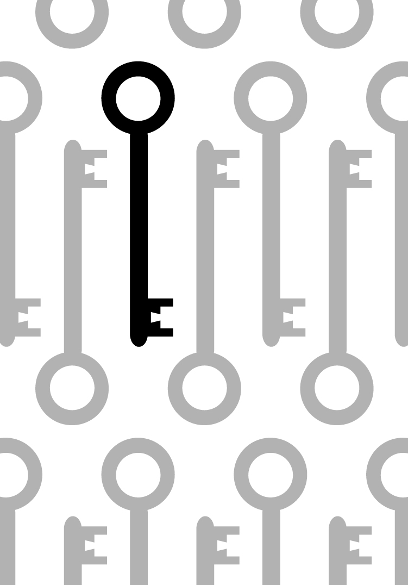
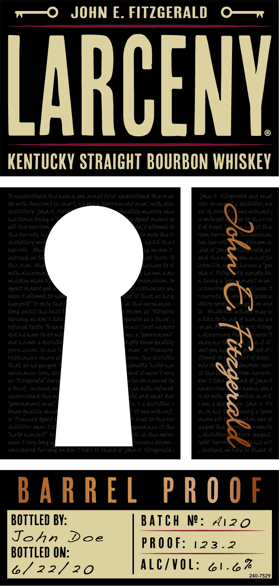
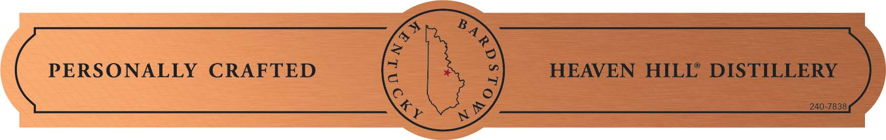

# TTB COLA Label Images - TTBID 21081001000429

**Brand Name:** LARCENY

**Issue Date:** 03/24/2021

**Origin Code:** 22

**Product Class/Type:** 101

**Source:** [TTB Public COLA Registry](https://ttbonline.gov/colasonline/viewColaDetails.do?action=publicFormDisplay&ttbid=21081001000429)

## Label Images

### Back Label

### Label 1

### Label 4

## Extracted Label Text

*Text extracted via OCR - may contain errors*

*2 image(s) excluded: text did not meet readability threshold*

**Detected Proof:** 123.2

### Label 1

w—O JOHN E. FITZGERALD O—r

LARCENY

KENTUCKY STRAIGHT BOURBON WHISKEY

;

R 0

BOTTLED BY:

John Doe

BATCH N°: Hizo

BOTTLED ON

PROOF: 123.2

6/22/20

ALC/VOL: 61.6%
